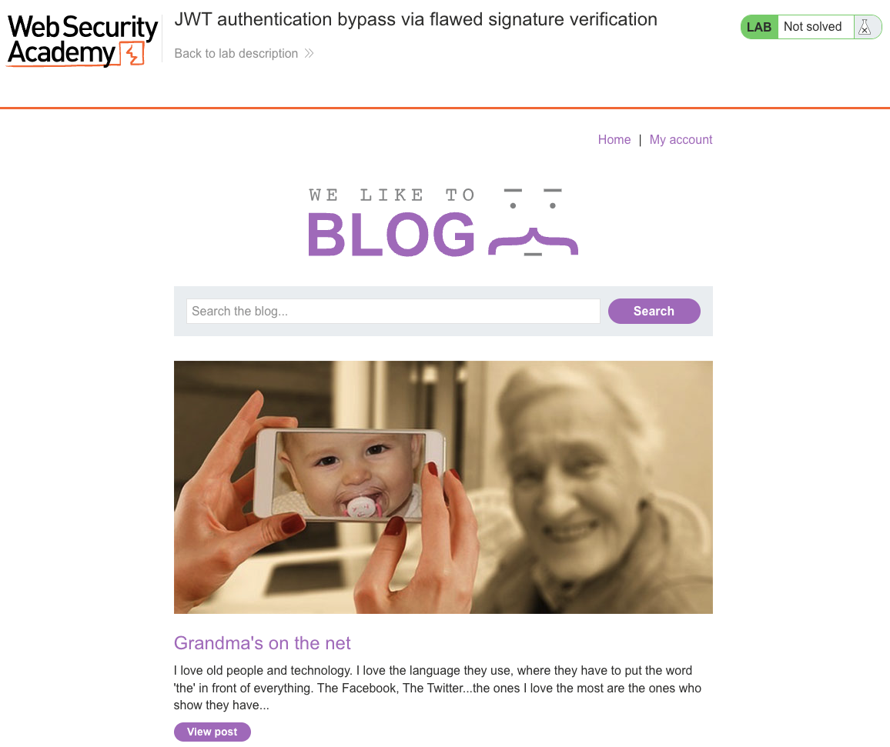
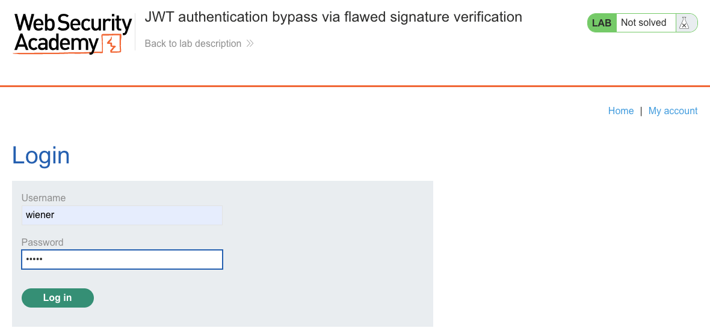
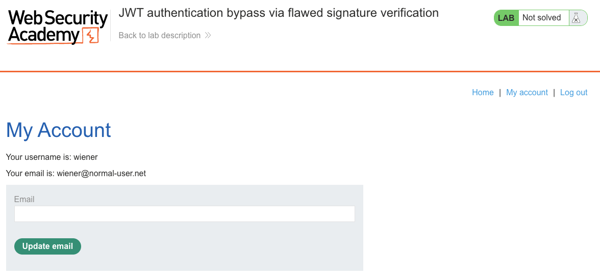
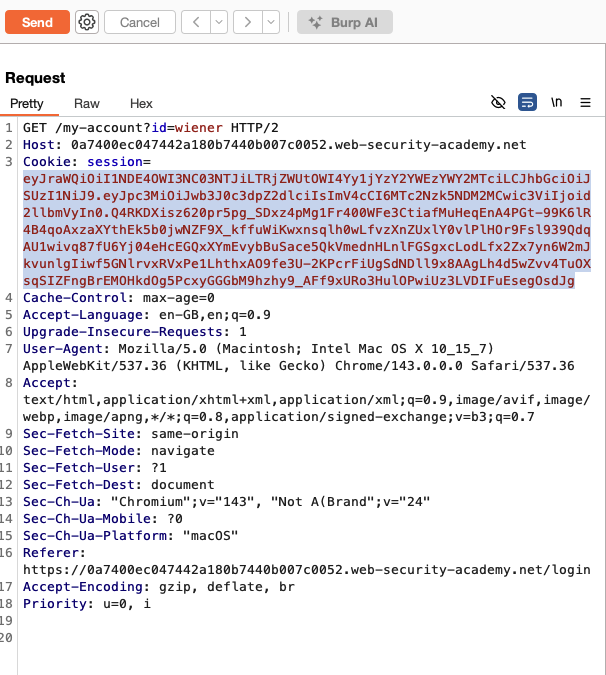
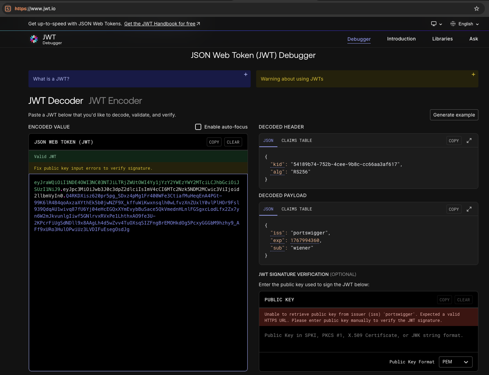
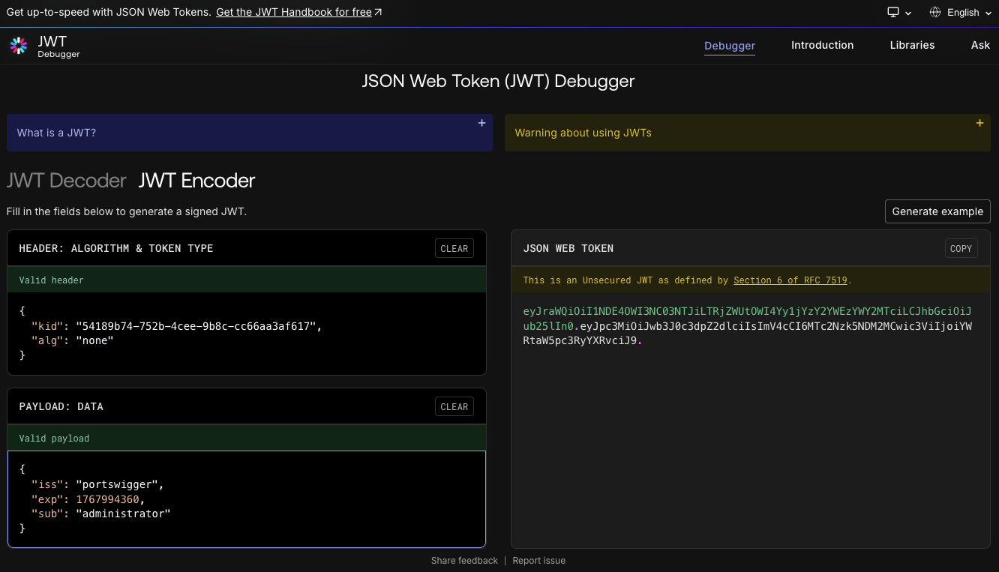
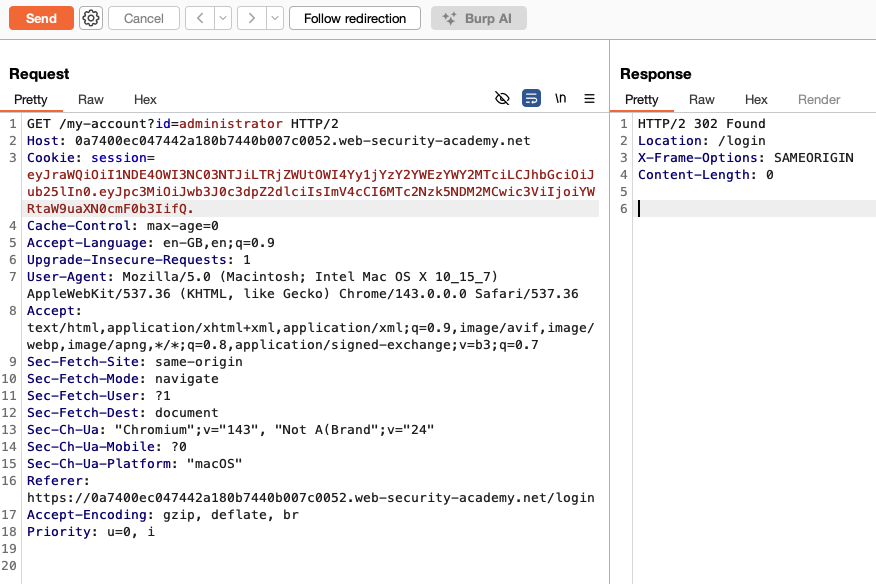
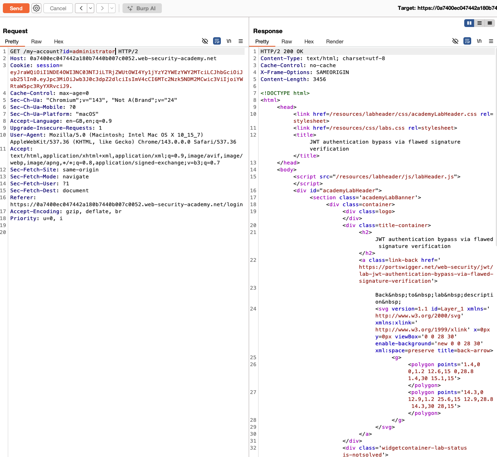
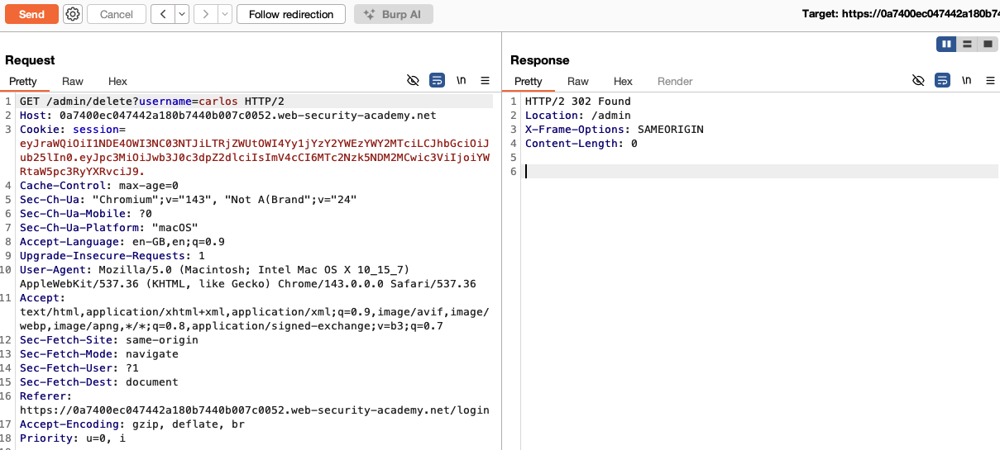
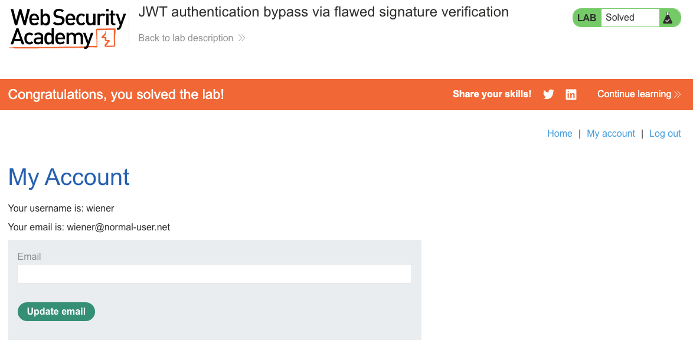

# JWT Authentication Bypass via Flawed Signature Verification

**Lab:** [JWT authentication bypass via flawed signature verification](https://portswigger.net/web-security/jwt/lab-jwt-authentication-bypass-via-flawed-signature-verification) (Web Security Academy)

**Level:** Apprentice

---

## Vulnerability Overview

A JSON Web Token (JWT) consists of three base64url-encoded parts separated by dots: a **header** (which declares the signing algorithm), a **payload** (the claims), and a **signature**. The signature is what proves the header and payload have not been tampered with - but only if the server actually enforces it.

This lab's server is insecurely configured to accept **unsigned** tokens. The JWT specification defines a `"none"` algorithm for tokens whose integrity has already been verified by other means, in which case the signature is omitted entirely. Because the server does not reject `"none"`, an attacker can strip the signature, set the algorithm to `none`, and change any claim they like - including `"sub": "administrator"` - and the server will treat the forged token as valid.

---

## Steps to Solve the Lab

1. **Open the lab**

   The lab is a blog application. The banner shows the lab as **Not solved**.

   

2. **Log in as `wiener`**

   Go to **My account** and log in with the credentials `wiener` / `peter`.

   

3. **Confirm the session**

   After logging in, the **My Account** page shows `Your username is: wiener`. With Burp's proxy running, this request is captured in the **HTTP history**.

   

4. **Locate the JWT in Burp**

   In Burp, send the authenticated `GET /my-account` request to **Repeater**. The `session` cookie holds the JWT (three base64url parts beginning with `eyJ...`).

   

5. **Decode the original JWT**

   Copy the token and paste it into a JWT decoder such as [jwt.io](https://jwt.io). The header shows `"alg": "RS256"` and the payload shows `"sub": "wiener"`.

   

6. **Forge an unsigned token (`alg: none`)**

   Switch to the **Encoder** tab and rebuild the token:
   - In the header, change `"alg"` to `"none"` (keep the original `kid`).
   - In the payload, change `"sub"` to `"administrator"` (keep `iss` and `exp`).

   The decoder now reports **"This is an Unsecured JWT as defined by Section 6 of RFC 7519"**, meaning the token carries no signature. The generated token ends with a **trailing dot** and no signature part (`header.payload.`).

   

   > **Note:** If you prefer Burp's **JWT Editor** extension, use its **Sign** dialog and select **"Don't modify header" / signing algorithm `none`**, then delete the signature manually - remembering to keep the trailing dot.

7. **Replay the request with the forged token**

   Back in Burp Repeater, replace the `session` cookie value with the forged token (include the trailing dot). Send `GET /my-account?id=administrator`. The server responds with **`200 OK`** and returns the administrator's account page, confirming the token was accepted.

   

   

8. **Delete `carlos`**

   Send `GET /admin/delete?username=carlos` with the forged token. The server responds with **`302 Found`** (redirecting to `/admin`), confirming the user was deleted.

   

9. **Lab solved**

   The lab banner updates to **"Congratulations, you solved the lab!"**.

   

---

## Why This Works

```text
Signed JWT (RS256):
  header.payload.signature   <- signature must be verified against a key

Unsigned JWT (alg: none):
  header.payload.            <- no signature; nothing to verify
```

The server reads the `alg` value from the token header and trusts it. When it sees `alg: none`, it concludes that no signature is required and accepts the token after decoding the payload. Because the attacker fully controls the payload, they can set `"sub": "administrator"` and be treated as an admin.

The root cause is that the server lets the token itself dictate whether (and how) the signature is checked, instead of enforcing a fixed, expected algorithm independently of the token header.

---

## Remediation

- **Reject `none` unconditionally.** Never accept unsigned tokens for authenticated sessions.
- **Pin the expected algorithm server-side** - never derive it from the token header:

  ```python
  # Correct: the server dictates the algorithm.
  jwt.decode(token, public_key, algorithms=["RS256"])

  # Vulnerable: the attacker dictates the algorithm.
  jwt.decode(token, public_key, algorithms=[header["alg"]])
  ```

- **Use a maintained JWT library** and keep it up to date; modern versions require the accepted algorithms to be listed explicitly at verification time.
- **Use short-lived tokens** with an `exp` claim, and validate `iss` (issuer) and `aud` (audience) to limit token reuse.

---

**Reference:** <https://portswigger.net/web-security/jwt/lab-jwt-authentication-bypass-via-flawed-signature-verification>
