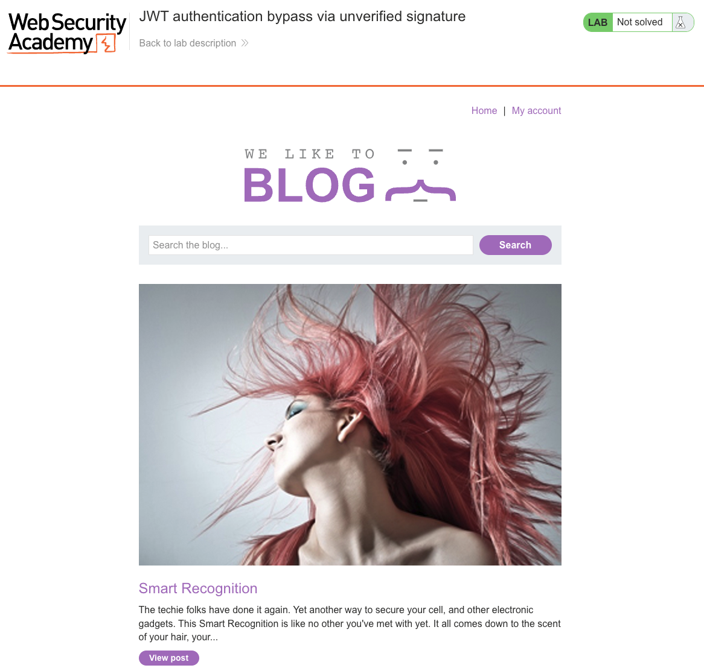
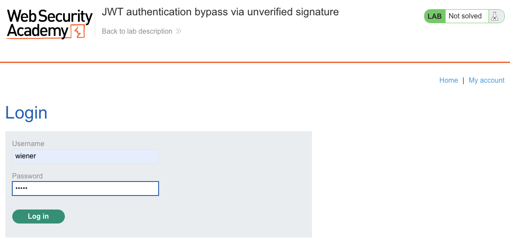
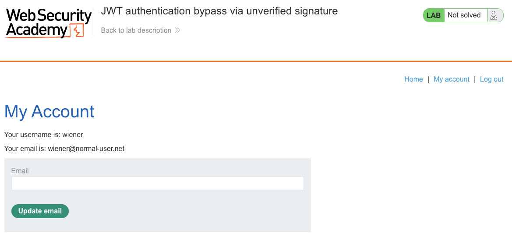
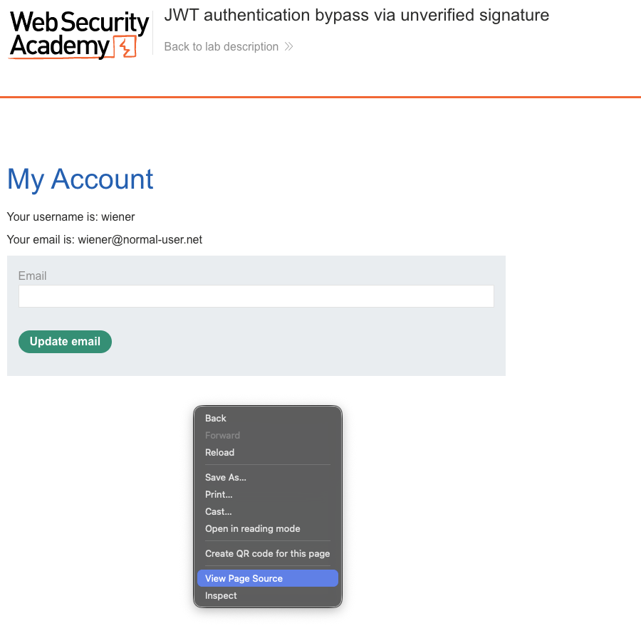
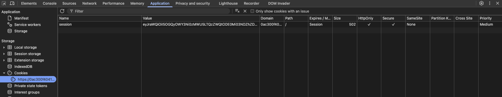
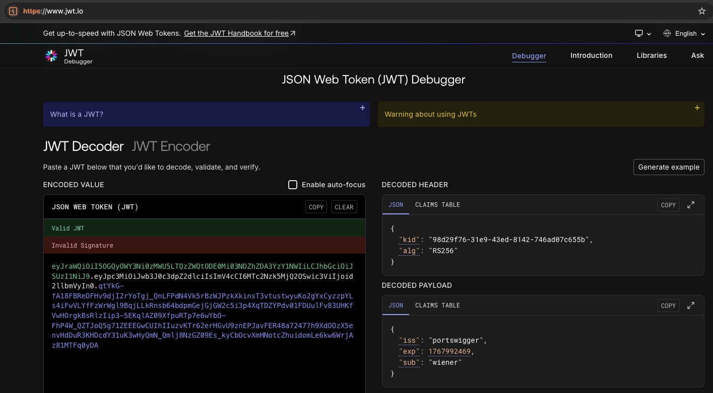
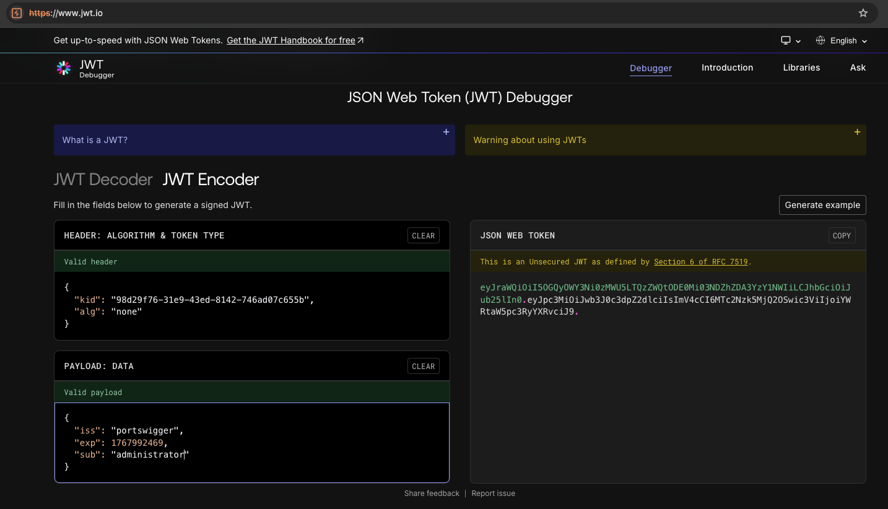
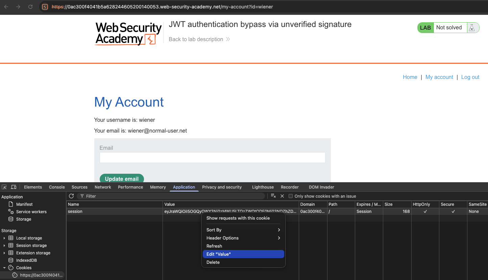
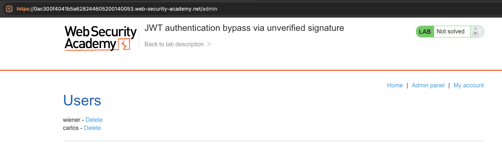
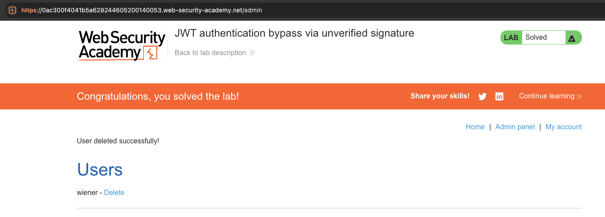

# JWT Authentication Bypass via Unverified Signature

**Lab:** [JWT authentication bypass via unverified signature](https://portswigger.net/web-security/jwt/lab-jwt-authentication-bypass-via-unverified-signature) (Web Security Academy)

**Level:** Apprentice

---

## Vulnerability Overview

A JSON Web Token (JWT) consists of three base64url-encoded parts separated by dots: a **header** (which declares the signing algorithm), a **payload** (the claims), and a **signature**. The signature proves the header and payload have not been tampered with - but only if the server actually verifies it.

In this lab the server **does not verify the JWT signature at all**. As a result, any change to the payload is accepted, regardless of whether the signature still matches. That means an attacker can simply change `"sub": "wiener"` to `"sub": "administrator"` to escalate to an administrator.

Because the signature is never checked, an unsigned token (`alg: none`, no signature) is accepted just as readily. The walkthrough below uses that `alg: none` variant, but note that keeping the original signature and only editing the payload would work equally well against this lab.

---

## Steps to Solve the Lab

1. **Open the lab**

   The lab is a blog application. The banner shows the lab as **Not solved**.

   

2. **Log in as `wiener`**

   Go to the login page and enter the credentials `wiener` / `peter`.

   

3. **Confirm login as `wiener`**

   After logging in, the **My Account** page shows `Your username is: wiener`.

   

4. **Open DevTools to find the JWT**

   Right-click anywhere on the page and choose **Inspect** (or press `F12`).

   

5. **Locate the session cookie**

   In DevTools, go to **Application -> Cookies**. Find the `session` cookie - its value is a JWT (three base64url parts separated by dots, beginning with `eyJ...`).

   

6. **Decode the original JWT**

   Copy the cookie value and paste it into a JWT decoder such as [jwt.io](https://jwt.io). The header shows `"alg": "RS256"` and the payload shows `"sub": "wiener"`. The decoder reports **Invalid Signature** because it has no key to verify against - that is expected here.

   

7. **Forge the token: set `alg` to `none` and `sub` to `administrator`**

   Switch to the **Encoder** tab and rebuild the token:
   - Set the header to (keep the original `kid`):
     ```json
     { "kid": "<original kid>", "alg": "none" }
     ```
   - Set the payload to (keep `iss` and `exp`, change `sub`):
     ```json
     { "iss": "portswigger", "exp": 1767992469, "sub": "administrator" }
     ```

   The decoder now reports **"This is an Unsecured JWT as defined by Section 6 of RFC 7519"**, meaning the token has no signature. Copy the generated token - it ends with a **trailing dot** and no signature part (`header.payload.`).

   

8. **Replace the session cookie**

   Back in DevTools, under **Application -> Cookies**, right-click the `session` cookie and choose **Edit Value**. Paste the forged token, including the trailing dot.

   

9. **Navigate to `/admin`**

   In the address bar, browse to `/admin`. The server accepts the forged token and grants admin access. The admin panel lists the users: `wiener - Delete` and `carlos - Delete`.

   

10. **Delete `carlos` - lab solved**

    Click **Delete** next to `carlos`. The page shows **"User deleted successfully!"** and the lab banner updates to **"Congratulations, you solved the lab!"**.

    

---

## Why This Works

The server never verifies the token's signature, so it has no way to detect that the payload was modified. Whatever `sub` value the token carries is trusted, which lets an attacker impersonate any user simply by editing the claim.

Setting `alg` to `none` and dropping the signature is one convenient way to demonstrate this, but it is not required: because verification is skipped entirely, even a token that keeps its original (now mismatched) signature is accepted.

---

## Remediation

- **Always verify the signature** of every JWT before trusting any of its claims.
- **Pin the expected algorithm** server-side and reject `none` - never derive the algorithm from the token header. In `jsonwebtoken` (Node.js): `jwt.verify(token, secret, { algorithms: ['RS256'] })`.
- **Use short-lived tokens** with an `exp` claim, and verify expiry server-side.
- **Validate `iss` (issuer) and `aud` (audience)** to prevent token reuse across services.

---

**Reference:** <https://portswigger.net/web-security/jwt/lab-jwt-authentication-bypass-via-unverified-signature>
