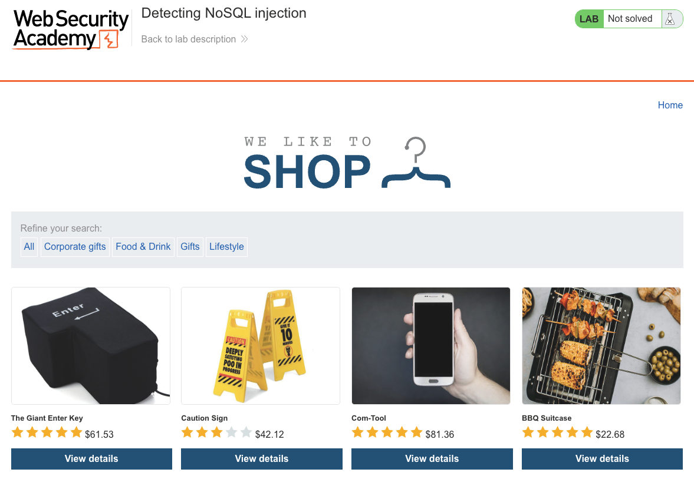
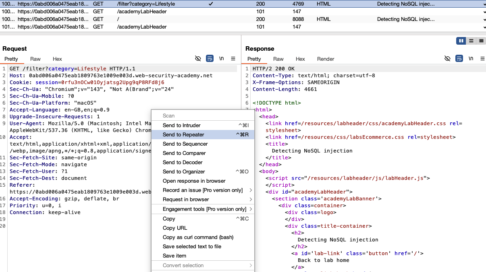
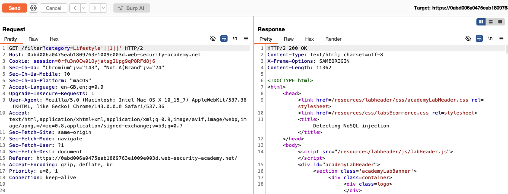
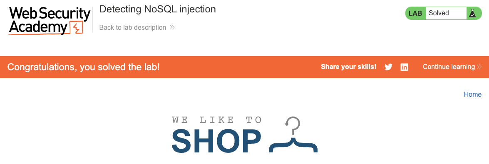

# NoSQL Injection

**Lab: Detecting NoSQL injection (Web Security Academy)**

**Level: Apprentice**

**Link:** https://portswigger.net/web-security/nosql-injection/lab-nosql-injection-detection

---

## Vulnerability Overview

Unlike SQL injection, NoSQL injection syntax is database-specific. In MongoDB, some query operators can evaluate JavaScript expressions (for example, the `$where` operator), so when user input is embedded directly into such a query without sanitization, an attacker can inject an expression that changes the query's logic.

In this lab, the product category filter is vulnerable. Appending `'||1||'` to a category value injects a JavaScript-style OR expression that is always truthy, effectively disabling the filter. Detection is a two-step process: first inject a single quote (`'`) to see whether it triggers an error or a changed response, then inject a boolean payload to confirm you control the query logic.

---

## Steps to Solve the Lab

1. **Open the lab**
   - The lab is a shop with product category filters.

   

2. **Intercept a category filter request**
   - Click on any category (for example, **Lifestyle**).
   - In Burp Suite, capture the request from **HTTP history** and send it to **Repeater** (right-click -> **Send to Repeater**).

   

3. **Inject a boolean payload into the category parameter**
   - In Repeater, locate the GET request: `GET /filter?category=Lifestyle`
   - Change the `category` value to `Lifestyle'||1||'` (URL-encoded on the wire, but Burp Repeater lets you type it directly):

     ```
     GET /filter?category=Lifestyle'||1||' HTTP/2
     ```

   - This injects a JavaScript-style `||` (OR) expression. Because `1` is truthy, the whole condition evaluates to `true` for every document, so all products are returned.

   

4. **Confirm the injection - lab solved**
   - The response includes products from every category, not just Lifestyle.
   - The server accepted the injected expression, confirming the backend is vulnerable to NoSQL injection.

   

---

## Why This Works

The vulnerable endpoint evaluates the `category` value using a JavaScript-style condition, roughly:

```javascript
this.category == 'Lifestyle'
```

Injecting `'||1||'` closes the original string and appends an OR clause, producing:

```javascript
this.category == 'Lifestyle'||1||''
```

Because `1` is truthy, the entire expression evaluates to `true` for every document in the collection, so the filter no longer filters anything.

The root cause is that user input is concatenated directly into the query expression instead of being passed as a typed, sanitized parameter.

> **Note:** PortSwigger's official detection payload is `'||'1'=='1`, which produces `this.category == 'Lifestyle'||'1'=='1'`. Both payloads work because they inject an always-true condition; `'||1||'` is a shorter equivalent.

---

## Remediation

- **Use typed query parameters.** Pass category values as strings with strict type checking - never concatenate user input into a query expression.
- **Sanitize operator characters.** Reject or escape characters such as `'`, `"`, `\`, `;`, and `||` in string inputs.
- **Avoid JavaScript-evaluating operators.** Do not use `$where`, `mapReduce`, or `$accumulator` with user-controlled input; disable server-side JavaScript where it is not required.
- **Use an ODM with a strict schema** (for example, [Mongoose](https://mongoosejs.com/)) that enforces expected field types.
