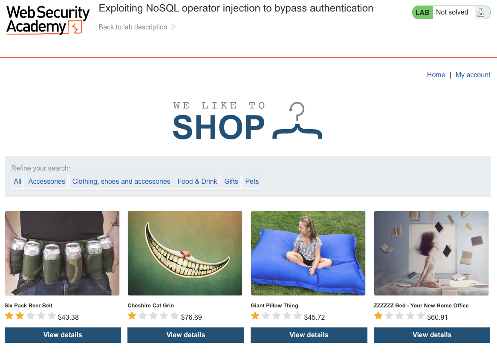
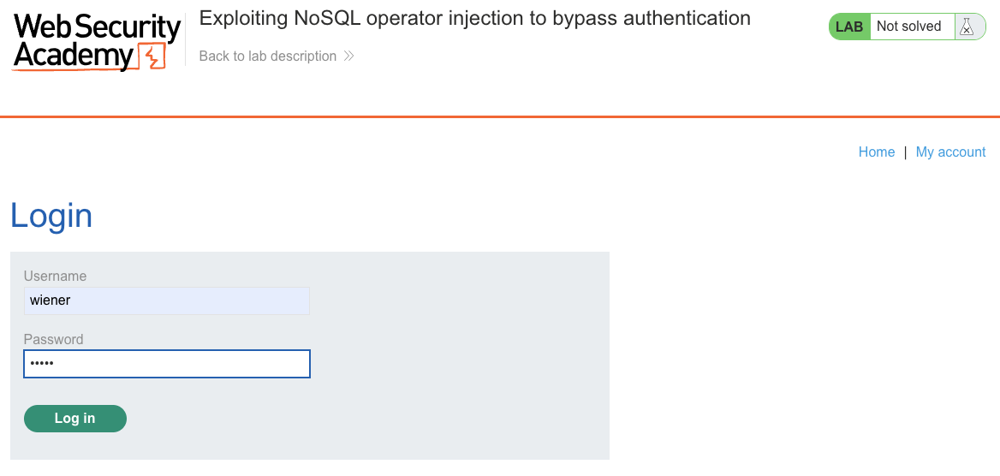
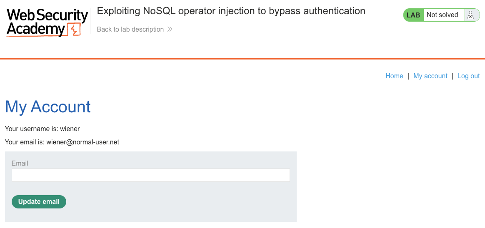
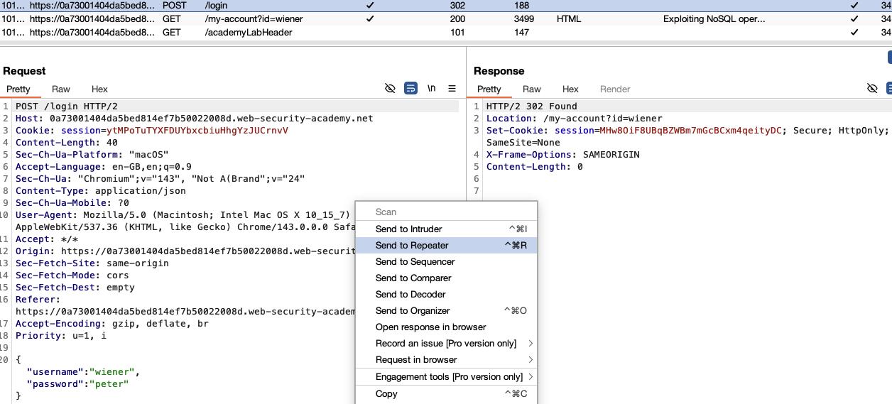
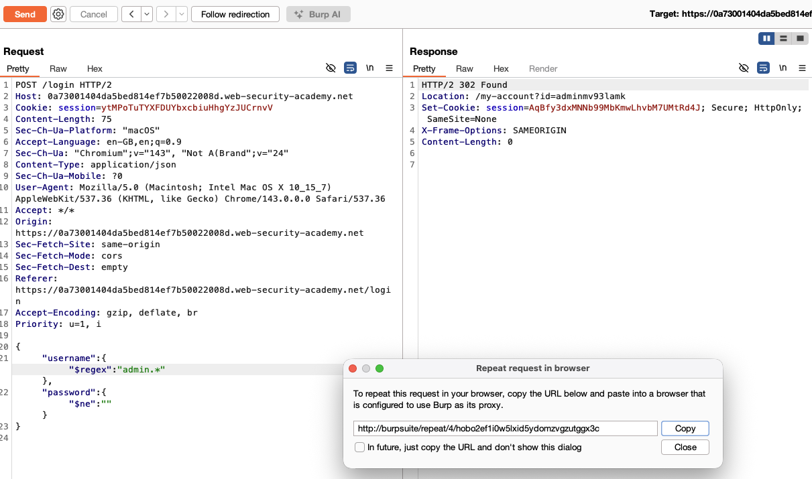
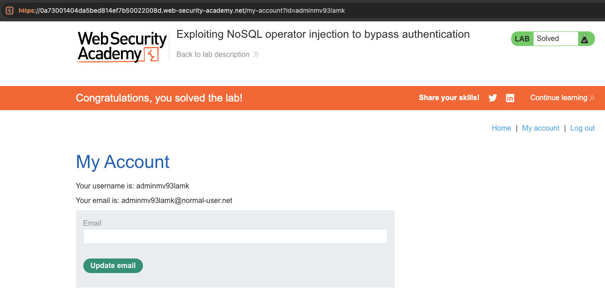

# NoSQL Injection

**Lab: Exploiting NoSQL operator injection to bypass authentication (Web Security Academy)**

**Level: Apprentice**

---

## Vulnerability Overview

This lab builds on basic NoSQL detection to achieve a full authentication bypass using operator injection. The login form sends credentials to the server as JSON and passes them directly into a MongoDB query. Because the values are parsed as JSON, an attacker can replace a plain string with a query-operator object (such as `$ne`, `$regex`, or `$gt`), changing what the query matches instead of supplying a literal value.

By injecting operators into the `username` and `password` fields, we can make the login query match the administrator account without knowing its password.

---

## Steps to Solve the Lab

1. **Open the lab**
   - The lab is a shop. Click **My account** in the navigation bar.

   

2. **Navigate to the login page**
   - The login form accepts a username and password.
   - Submit a legitimate login as `wiener:peter` to capture the `POST /login` request in Burp.

   

3. **Confirm the normal login flow**
   - After a normal login, you land on the My Account page as `wiener`. This confirms the session flow works and that the `POST /login` request is now in Burp's HTTP history.

   

4. **Send the login request to Burp Repeater**
   - In Burp **HTTP history**, find the `POST /login` request. Its JSON body is `{"username":"wiener","password":"peter"}`.
   - Right-click -> **Send to Repeater**.

   

5. **Inject NoSQL operators**
   - In Repeater, replace the JSON body with an operator-injection payload that targets the admin account:

     ```json
     {"username": {"$regex": "admin.*"}, "password": {"$ne": ""}}
     ```

   - This tells MongoDB: *find a user whose username matches the regular expression `admin.*` and whose password is not an empty string* - which matches the administrator account without knowing its password.
   - Send the request. The server responds with `302 Found`, a `Location` header pointing to the admin account's My Account page (for example, `/my-account?id=administrator` - the exact username is randomized per lab instance), and a new session cookie.
   - In Burp, use **Request in browser** -> **In original session**, copy the URL, and open it in your browser.

   

6. **Access the admin account - lab solved**
   - The browser redirects to `/my-account`, and you are logged in as the administrator.
   - The lab is marked as **Solved**.

   

---

## Why This Works

The application builds the MongoDB query directly from the parsed JSON body, roughly:

```javascript
db.users.findOne({ username: req.body.username, password: req.body.password })
```

When the body is parsed as JSON, `{"$regex": "admin.*"}` is passed as a MongoDB **operator object** rather than a string, so the query becomes:

```javascript
db.users.findOne({ username: { $regex: "admin.*" }, password: { $ne: "" } })
```

Instead of comparing `username` to a literal string, MongoDB now evaluates it as a pattern match, and `password` is only required to be non-empty. The query matches the administrator account, and the application logs you in as that user.

### Alternative payload

PortSwigger's official solution uses the `$ne` (not equal) operator on both fields:

```json
{"username": {"$ne": "invalid"}, "password": {"$ne": "invalid"}}
```

This matches any user whose username and password are both not equal to `"invalid"`, and the query returns the **first** matching document. This works in the lab because the administrator is the first user in the collection, but it is less precise than the `$regex` payload, which targets the admin account explicitly. Both approaches solve the lab.

---

## Remediation

- **Reject non-string types.** Validate that `username` and `password` are plain strings. If a parsed value is an object or array, return `400 Bad Request`.
- **Sanitize operator keys.** Strip or reject any keys beginning with `$` (and dotted keys) from user-supplied input.
- **Use an ODM with a strict schema.** [Mongoose](https://mongoosejs.com/) with a strict schema will not accept an object where a string field is expected.
- **Apply the principle of least privilege.** The application's database account should have only the permissions it needs.

---

Link: https://portswigger.net/web-security/nosql-injection/lab-nosql-injection-bypass-authentication
