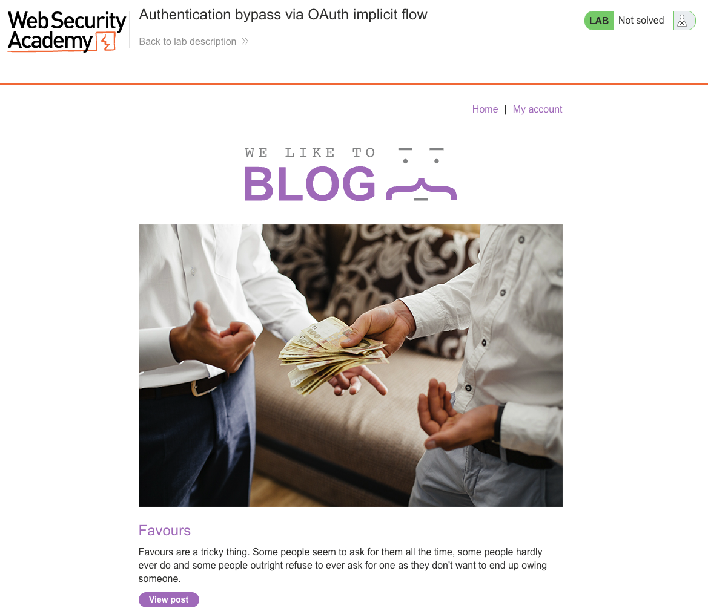
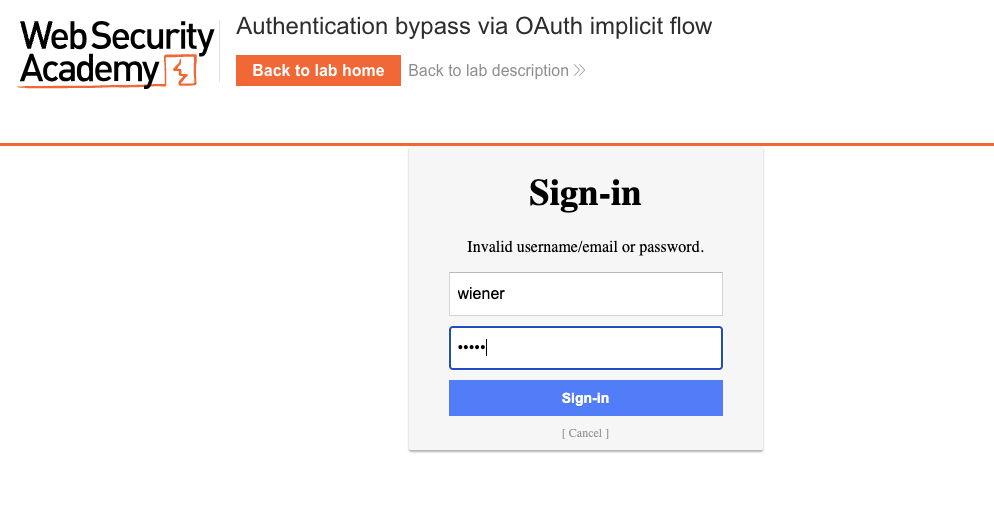
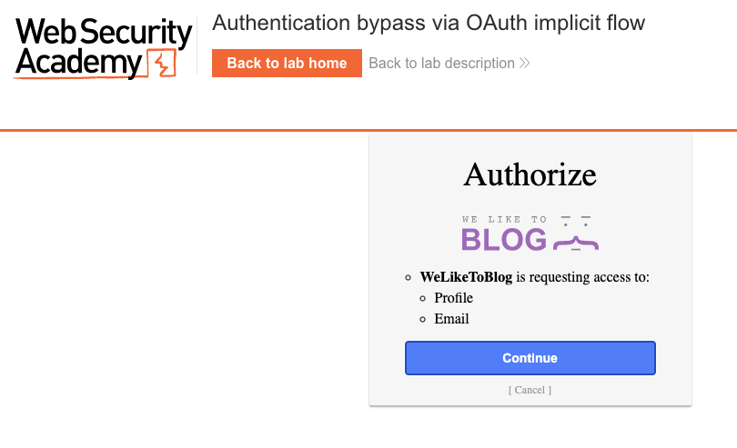
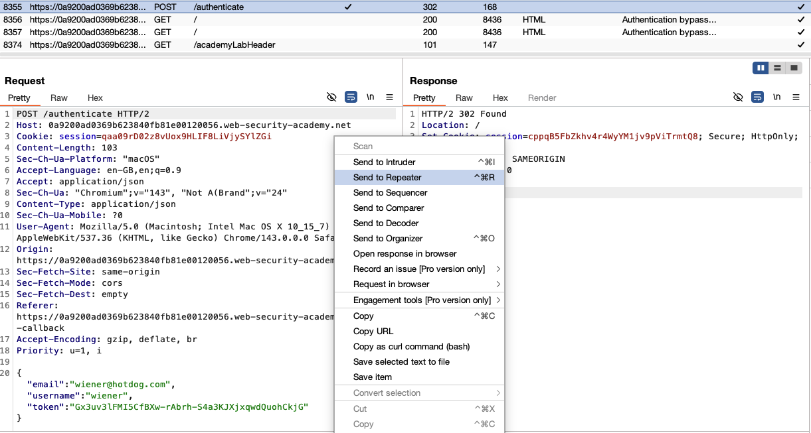
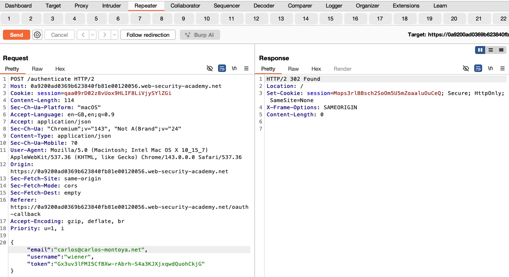
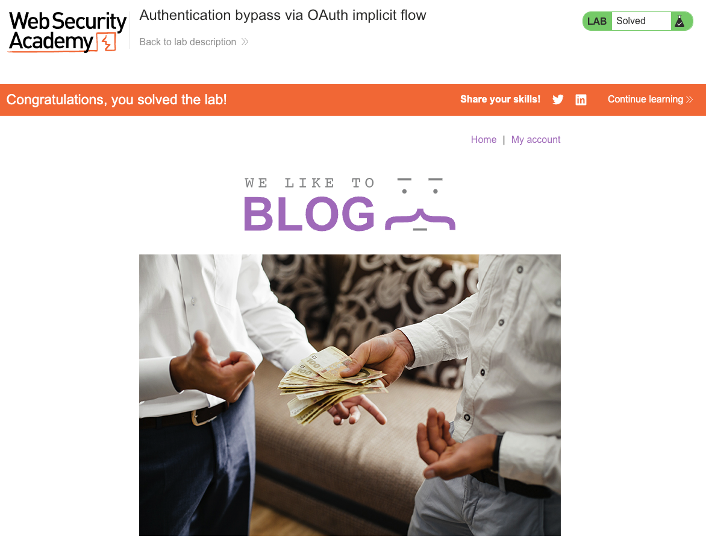

# OAuth Authentication

**Lab: Authentication bypass via OAuth implicit flow (Web Security Academy)**

**Level: Apprentice**

---

## Vulnerability Overview

The OAuth implicit flow is a simplified OAuth 2.0 grant type designed for single-page applications. After the user authorizes the OAuth provider, the access token is returned directly in the URL fragment and passed to the client application. The client then sends this token - along with the user's identity data - to the application's own backend to create a session.

The vulnerability lies in how the backend handles that identity data: it blindly trusts the `email` value submitted by the client. An attacker who holds a valid OAuth token can change the `email` field in the authentication request to any address and impersonate another user. The backend never cross-checks the `email` against the token itself or against the OAuth provider - it simply creates a session for whatever email is presented.

---

## Steps to Solve the Lab

### 1. Log in using OAuth and capture the authentication request

Open the lab. You start on the blog home page, which is marked **Not solved**.



- Click **Sign in with social provider**.
- Complete the OAuth flow as `wiener` (username `wiener`, password `peter`) on the provider's sign-in page.



- Authorize the application when prompted on the consent screen.



- In Burp's **HTTP history**, find the `POST /authenticate` request that the blog sends after receiving the OAuth token. The request body is JSON and looks like this:
  ```json
  {"email":"wiener@hotdog.com","username":"wiener","token":"..."}
  ```
- Right-click the request and select **Send to Repeater**.



### 2. Modify the email to impersonate carlos

In Repeater, change the `email` value to `carlos@carlos-montoya.net` while keeping the valid OAuth `token` unchanged, then send the request:

```json
{"email":"carlos@carlos-montoya.net","username":"wiener","token":"..."}
```

The server responds with `302 Found` and issues a new session cookie for carlos's account.



### 3. Follow the session

Load the site using the new session. In Burp, right-click the response and select **Request in browser** (or copy the `session` cookie into your browser).

### 4. Confirm account takeover

The blog now shows that you are logged in as carlos, and the lab banner changes to **"Congratulations, you solved the lab!"**.



---

## Why This Works

The authentication endpoint at `/authenticate` accepts the user's identity data from the client and creates a session based on it:

```python
# Vulnerable pseudocode
def authenticate(request):
    email = request.json['email']     # attacker-controlled
    token = request.json['token']
    # The token is validated with the OAuth provider,
    # but the email is never cross-checked against the token's subject.
    user = db.get_or_create_user(email=email)
    return create_session(user)
```

The token proves that the user authenticated with the OAuth provider, but it does not prove that they own the `email` the client claims. Because the email is used to look up the local account, it becomes the authorization-critical value - and the attacker can set it freely.

---

## Remediation

- **Never trust identity data sent by the client alongside an OAuth token.** Always fetch the user's identity directly from the OAuth provider using the access token:
  ```python
  # Correct approach
  token = request.json['token']
  user_info = oauth_provider.get_user_info(token)   # server-to-server call
  email = user_info['email']                         # email from the provider, not the client
  user = db.get_or_create_user(email=email)
  ```
- **Prefer the OAuth Authorization Code flow over the Implicit flow.** The Authorization Code flow keeps the access token off the client and is the currently recommended approach; the Implicit flow is omitted from OAuth 2.1 and is no longer recommended.
- **Key the user lookup on the token's `sub` (subject) claim.** The `sub` is a stable, provider-assigned user identifier. Use it - not the email - as the primary account key.

---

Lab link: <https://portswigger.net/web-security/oauth/lab-oauth-authentication-bypass-via-oauth-implicit-flow>
