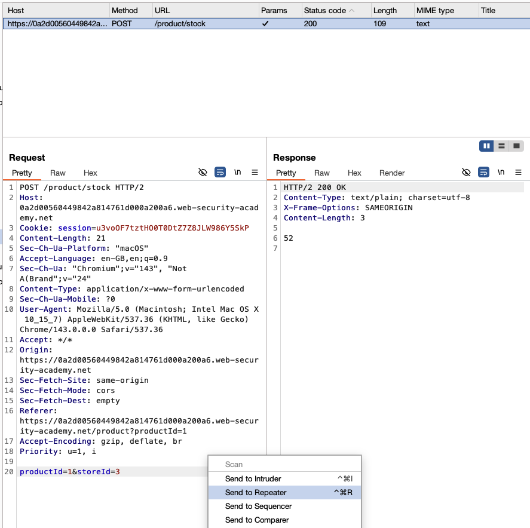
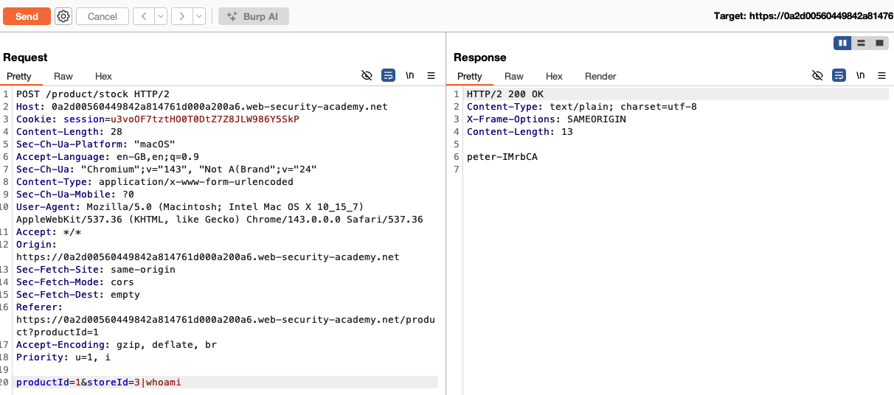
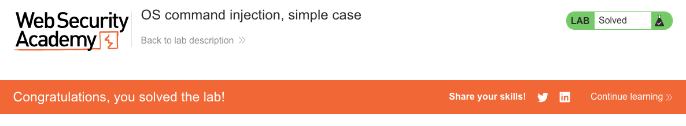

# OS Command Injection

**Lab: OS command injection, simple case (Web Security Academy)**

**Level: Apprentice**

---

## Vulnerability Overview

OS command injection occurs when an application passes user-supplied input to a system shell without sanitization. The server executes the injected command with its own privileges, giving the attacker direct access to the underlying operating system.

In this lab, a stock-checking feature sends product and store IDs to the server, which builds a shell command using those values. Because the input is concatenated directly into the command string, injecting a shell separator (`|`, `;`, `&&`) appends a second command that the server executes and returns in the response.

This is one of the most severe vulnerability classes: a single injection point can lead to full server compromise.

---

## Steps to Solve the Lab

### 1. Identify the vulnerable functionality

Open a product page and click **Check stock**. This sends a `POST` request to `/product/stock` with the parameters `productId` and `storeId`.


The store selector maps each store name to a numeric `storeId` (for example, London, Paris, and Milan correspond to `1`, `2`, and `3`).


### 2. Capture the request

Intercept the **Check stock** request in Burp Suite and send it to **Repeater**.



The body contains the two parameters that are passed to the shell:

```
productId=1&storeId=3
```

### 3. Inject an OS command

In Repeater, modify the `storeId` parameter to append a shell command:

```
productId=1&storeId=3|whoami
```

The `|` (pipe) character is a shell operator. In this attack it acts as a command separator: the shell runs the original stock-check command, then runs `whoami` as a second command.

### 4. Confirm code execution

Send the modified request. Because `whoami` does not read from standard input, its output replaces the stock result in the response, for example:

```
peter-IMrbCA
```



This confirms that arbitrary OS commands execute on the server in the context of the web application's user.

### 5. Result

The lab status changes to **Solved**.



---

## Why This Works

The server builds a shell command by concatenating user input:

```bash
# Server-side (pseudocode):
command = "stockreport.sh " + productId + " " + storeId
os.execute(command)
```

With `storeId=3|whoami`, the executed command line becomes:

```bash
stockreport.sh 1 3|whoami
```

The shell interprets `|` as a pipe operator, so it runs two commands: `stockreport.sh 1 3` and `whoami`. Since `whoami` ignores the piped input, only its output (`peter-IMrbCA`) is returned in the HTTP response, replacing the stock result.

Common separators that work depending on the shell and OS:

| Separator | Behavior |
|---|---|
| `\|` | Pipe: runs both commands; the second reads the first command's output as input |
| `;` | Sequential: runs both commands regardless of exit code |
| `&&` | Runs the second command only if the first succeeds |
| `\|\|` | Runs the second command only if the first fails |
| `&` | Runs the first command in the background, then runs the second |

> On Windows, `;` does not chain commands in `cmd.exe`; use `&`, `&&`, `|`, or `||` instead.

---

## Remediation

- **Never pass user input to a shell.** This is the only reliable fix. Use language-native APIs that don't invoke a shell:
  ```python
  # WRONG: shell=True passes the input to /bin/sh
  subprocess.run("stockreport.sh " + product_id + " " + store_id, shell=True)

  # CORRECT: list form, no shell involved
  subprocess.run(["stockreport.sh", product_id, store_id])
  ```
- **Validate input against an allowlist.** If `storeId` must be an integer, reject anything that isn't. Where possible, validate against a known-good list of permitted values rather than trying to block bad characters.
- **Run with least privilege.** The web application process should not run as root. This limits what an attacker can do even if injection succeeds.
- **Replace shell commands with library calls.** Most shell utilities have native library equivalents that don't require spawning a subprocess at all.

---

Lab: https://portswigger.net/web-security/os-command-injection/lab-simple
