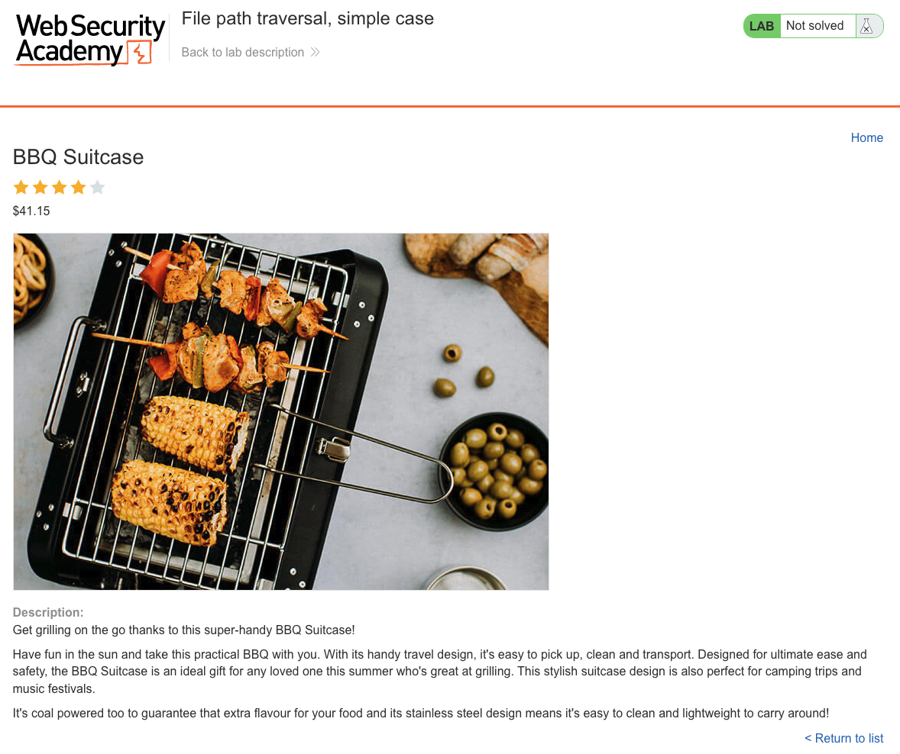
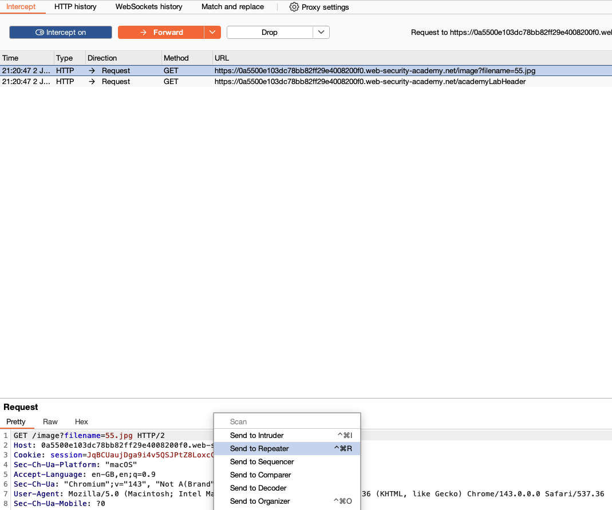
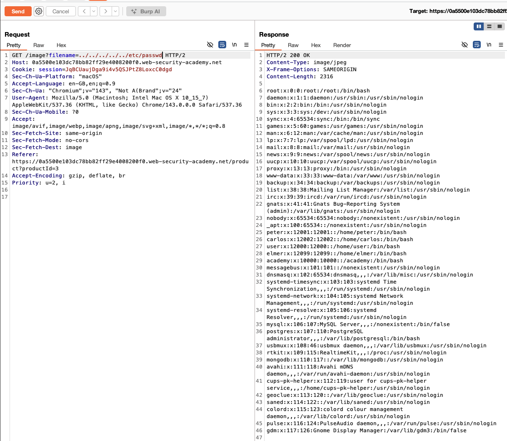
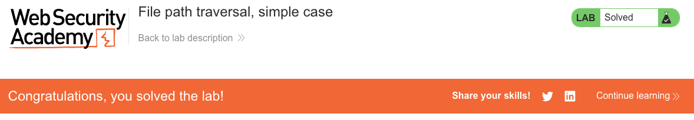

# Path Traversal

**Lab: File path traversal, simple case (Web Security Academy)**

**Level: Apprentice**

---

## Vulnerability Overview

Path traversal (also known as directory traversal) occurs when a server builds a filesystem path from user-supplied input without properly sanitizing `../` sequences. The `../` sequence tells the filesystem to move one directory up. By chaining enough `../` segments, an attacker can escape the intended directory and read arbitrary files that are accessible to the web server process - including sensitive system files such as `/etc/passwd`, application source code, or private keys.

In this lab, product images are loaded through a `filename` parameter that is concatenated directly into a filesystem path. Injecting a payload such as `../../../etc/passwd` traverses out of the image directory and reads the system password file.

---

## Steps to Solve the Lab

1. **Identify the vulnerable parameter**
   - Open the lab and browse the shop. Each product on the home page is displayed with its own image.

     

   - Open any product page (for example, *BBQ Suitcase*). The product image is loaded through a dedicated request.

     

   - The image is fetched via a request like:
     ```http
     GET /image?filename=55.jpg
     ```
   - Intercept this request in Burp Proxy and send it to **Repeater** (`Ctrl+R` / `Cmd+R`).

     

2. **Inject a path traversal payload**
   - Change the `filename` parameter to:
     ```
     ../../../etc/passwd
     ```
   - The full request line becomes:
     ```http
     GET /image?filename=../../../etc/passwd
     ```

3. **Observe the file disclosure**
   - The server responds with `200 OK` and returns the contents of `/etc/passwd`:
     ```
     root:x:0:0:root:/root:/bin/bash
     daemon:x:1:1:daemon:/usr/sbin:/usr/sbin/nologin
     ...
     ```

     

   - The number of `../` segments needed depends on how deep the image directory sits in the filesystem. Adding more segments than required is harmless, because `..` at the filesystem root simply resolves back to the root, so a payload with several segments (for example, `../../../../../etc/passwd`) reliably reaches the target regardless of the exact directory depth.

4. **Result**
   - Reading `/etc/passwd` confirms arbitrary file disclosure. The lab status changes to **Solved**.

     

---

## Why This Works

The server builds a filesystem path by concatenating the `filename` parameter onto a base directory:

```python
# Vulnerable pseudocode:
def serve_image(request):
    filename = request.args.get('filename')
    path = '/var/www/images/' + filename      # no sanitization
    return open(path).read()
```

With `filename=../../../etc/passwd`, the path resolves as follows:

```
/var/www/images/../../../etc/passwd
-> /etc/passwd
```

The OS resolves the `..` components and returns the file. The web server process has read access to `/etc/passwd` (which is world-readable on Linux), so the read succeeds.

---

## Remediation

- **Validate against a resolved canonical path.** After joining the user input with the base directory, resolve the absolute path and verify that it still sits within the allowed base directory:
  ```python
  import os

  base = os.path.realpath('/var/www/images')
  requested = os.path.realpath(os.path.join(base, filename))
  if not (requested == base or requested.startswith(base + os.sep)):
      abort(400, "Invalid filename")
  return open(requested).read()
  ```
  `os.path.realpath()` resolves all `..` components (and symlinks) before the check is performed.
- **Use an allowlist for filenames.** If valid filenames follow a known pattern (for example, `[a-zA-Z0-9_-]+\.(jpg|png|gif)`), reject anything that does not match.
- **Serve files indirectly.** Map user-facing IDs to filesystem paths on the server side, and never pass raw filenames from the client to the filesystem.
- **Run the web server with least privilege.** The process should only have read access to the directories it genuinely needs.

---

Link: https://portswigger.net/web-security/file-path-traversal/lab-simple

Further reading:
- Web Security Academy - Path traversal: https://portswigger.net/web-security/file-path-traversal
- OWASP - Path Traversal: https://owasp.org/www-community/attacks/Path_Traversal
