# Race Conditions
**Lab: Limit overrun race conditions (Web Security Academy)**

**Level: Apprentice**

---

## Vulnerability Overview

A race condition occurs when a system's behavior depends on the timing of concurrent operations. In this lab, a coupon code has a single-use limit enforced by a check-then-act pattern: the server checks whether the code has already been applied and, if not, applies the discount and records the code as used. However, if several requests arrive at almost the same time, multiple of them can pass the "has it been applied?" check before any single request records the code as used - allowing the same 20% discount to be applied more than once.

This is a **time-of-check to time-of-use (TOCTOU)** race condition. The window between the check and the update is small, but Burp Suite can send a batch of requests in parallel so that they reach the server within the same short window, reliably triggering the race.

---

## Steps to Solve the Lab

1. **Open the lab and log in**
   - The store advertises `PROMO20` for 20% off at checkout.

   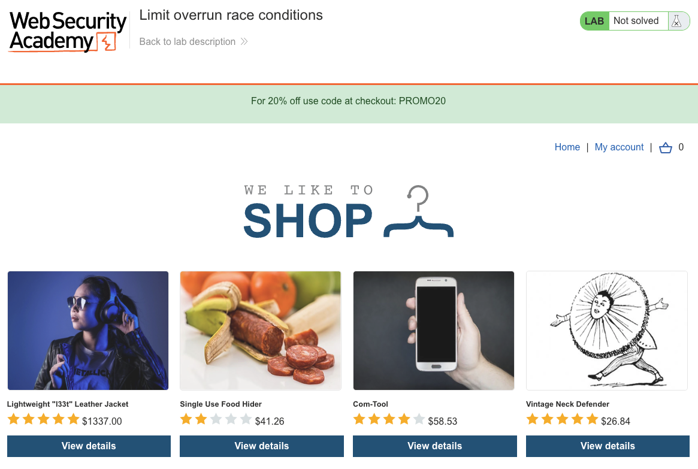

   - Log in as `wiener` with password `peter`.

   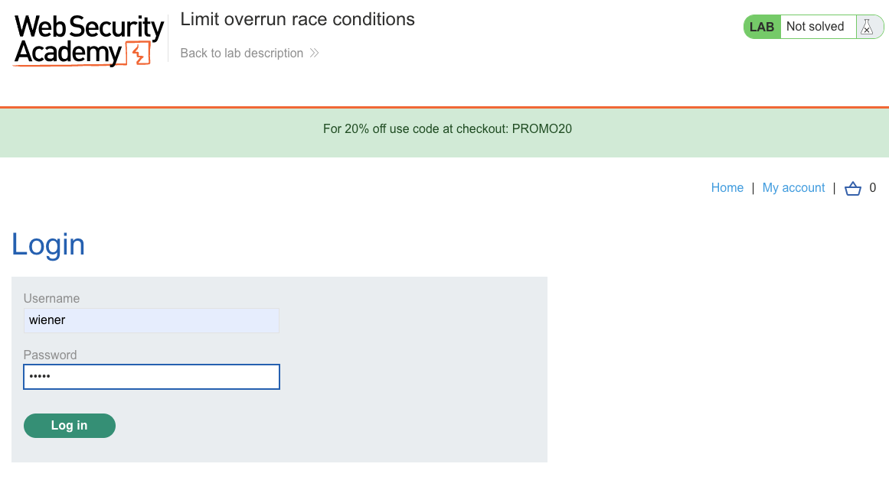

2. **Confirm your store credit**
   - On the **My account** page, note the store credit of **$50.00**. The target item, the "Lightweight l33t Leather Jacket", costs **$1337.00**, so it cannot be bought with a single 20% discount.

   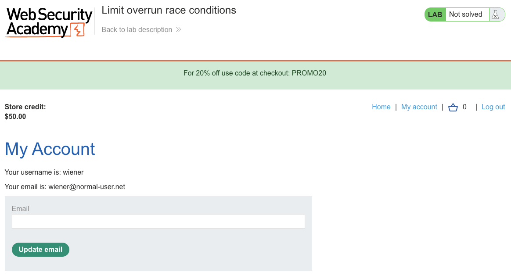

3. **Add a cheap item to the cart**
   - Open a low-priced product - for example, "Waterproof Tea Bags" ($41.93) - and click **Add to cart**. A cheap item is used to probe the coupon behavior before spending time on the jacket.

   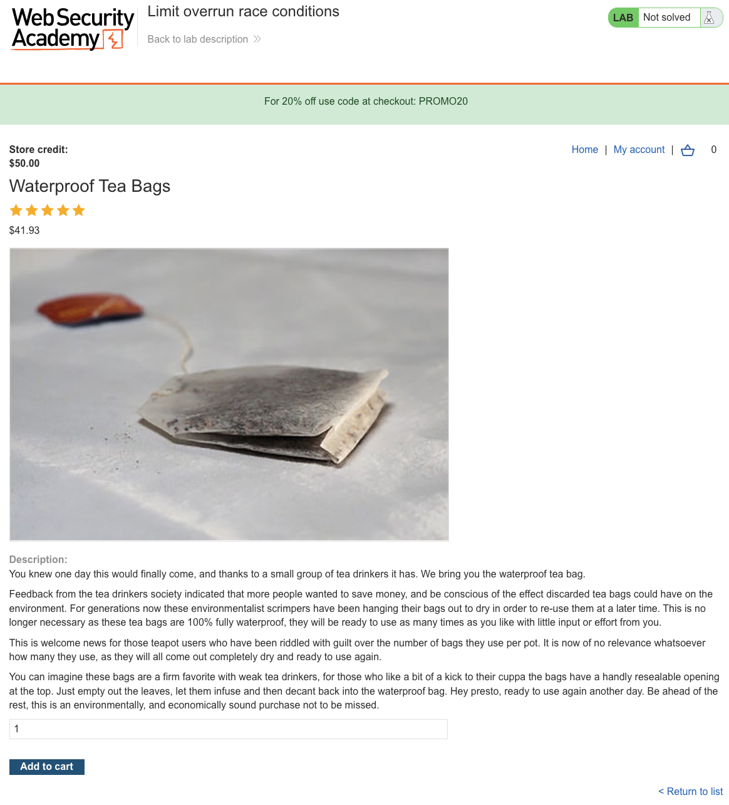

   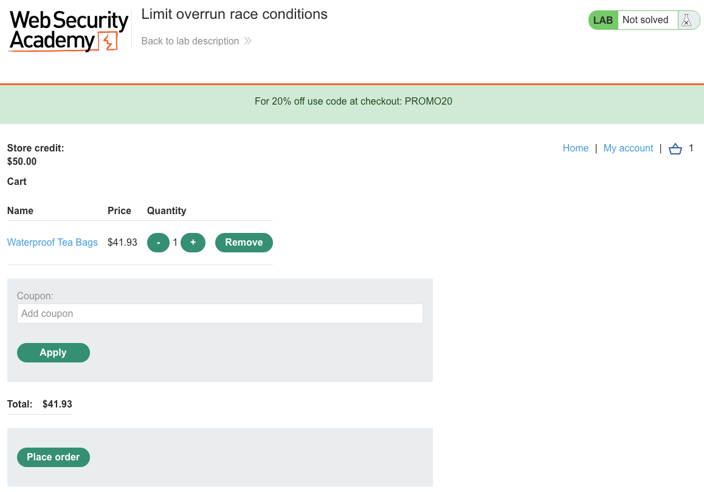

4. **Apply the coupon once to confirm it works**
   - In the cart, enter `PROMO20` and click **Apply**.
   - The coupon is accepted and a **PROMO20** reduction appears, lowering the total.

   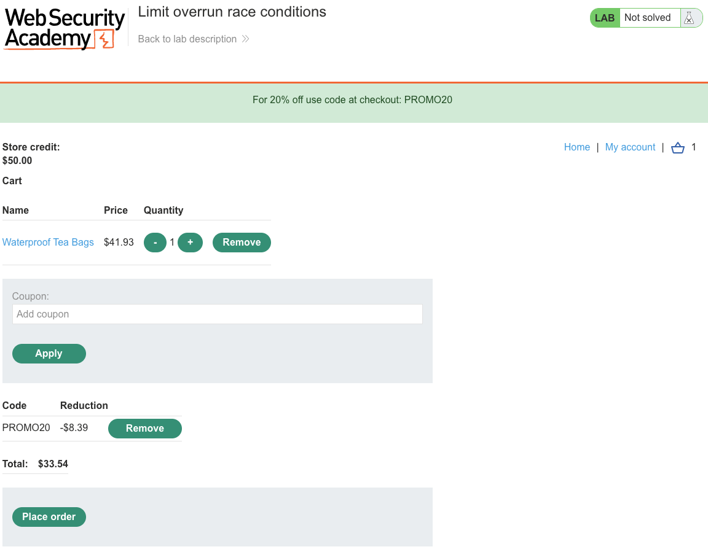

5. **Capture the coupon request in Burp**
   - With Burp proxying the traffic, apply the coupon again and find the `POST /cart/coupon` request in the **HTTP history**.
   - The request body contains `csrf=...&coupon=PROMO20`, and the response is `Coupon applied`.

   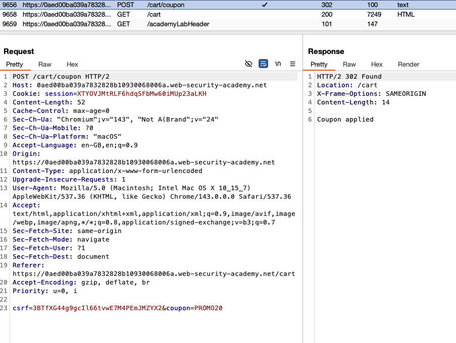

6. **Build a parallel request group**
   - Send the `POST /cart/coupon` request to **Repeater**.
   - Duplicate the tab until you have about 20 identical tabs, then add them all to a **tab group**.
   - Selecting **Send group (single connection)** first, one at a time, only ever returns `Coupon already applied` after the first success - this is the normal, non-racing behavior.

   > **Note:** In Burp Suite Professional you can instead right-click the request and choose the **Trigger race condition** extension action, which sends the request 20 times in parallel for you.

   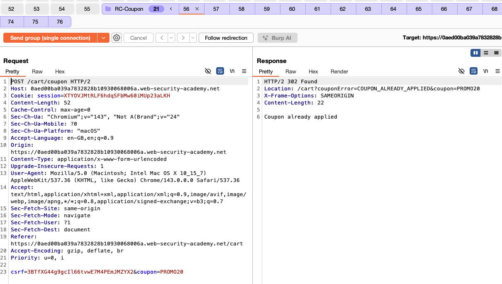

7. **Send the group in parallel to trigger the race**
   - Change the send mode to **Send group (parallel)** and send.
   - Burp dispatches all the requests using the single-packet attack, so they hit the server within the same race window.
   - Refresh the cart: the **PROMO20** reduction is now much larger than 20%, because the discount was applied several times before the coupon was locked.

   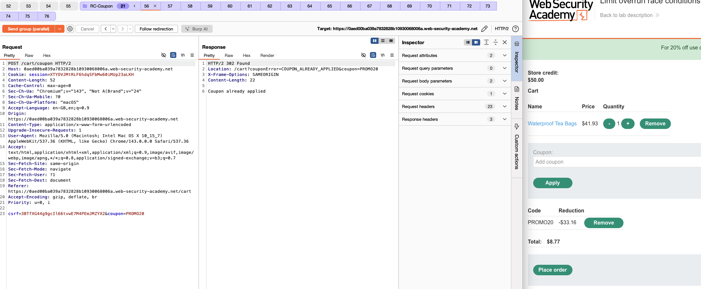

8. **Buy the jacket at the reduced price**
   - Add the "Lightweight l33t Leather Jacket" ($1337.00) to the cart.

   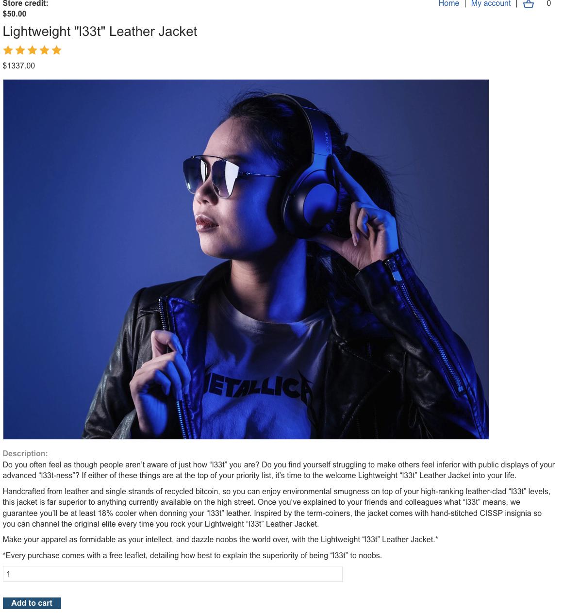

   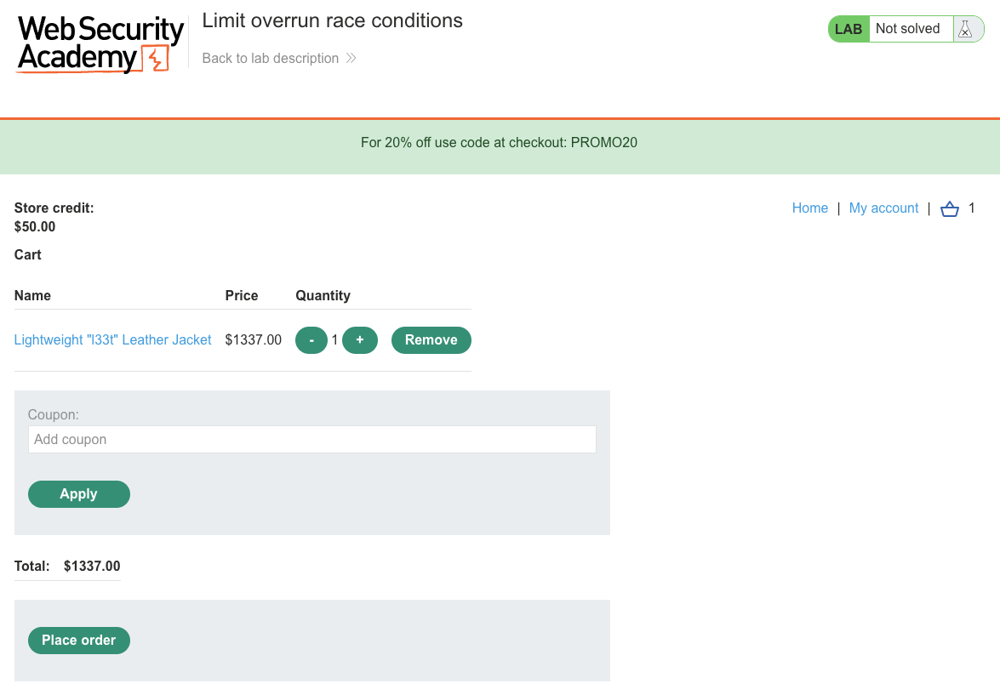

   - Re-run the parallel coupon group. The stacked 20% reductions drive the total well below your $50.00 store credit.

   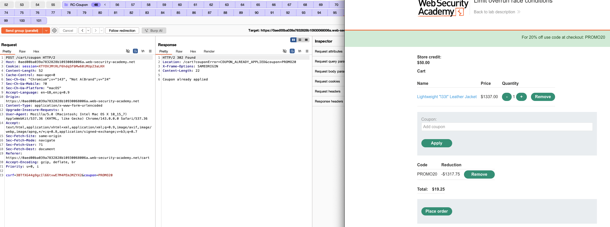

9. **Place the order**
   - Click **Place order**. The purchase succeeds and the lab is marked as **Solved**.

   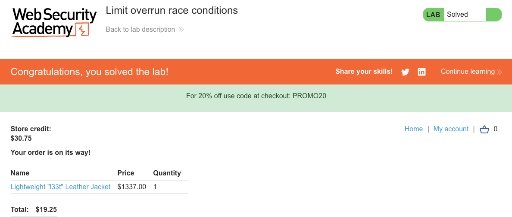

---

## Why This Works

The server's coupon logic follows a check-then-act pattern similar to this:

```python
# Vulnerable pseudocode (TOCTOU):
def apply_coupon(cart_id, coupon_code):
    if coupon_already_applied(cart_id, coupon_code):   # CHECK
        return error("Coupon already applied")
    apply_discount(cart_id, coupon_code)               # ACT
    mark_as_applied(cart_id, coupon_code)              # UPDATE
```

When ~20 requests arrive in parallel:
- Each request calls `coupon_already_applied()` - and none of them sees the code as applied yet, because no request has reached the `mark_as_applied()` step.
- All of them pass the check.
- All of them call `apply_discount()`, so the 20% reduction is applied multiple times and the total collapses far below its intended floor.

The race window is only a few milliseconds - small enough that a normal user never triggers it, but large enough for a batch of requests delivered together to slip through. The single-packet attack (used by **Send group (parallel)**) is what makes this reliable: it removes most of the network timing jitter, so all the requests are processed in the same window regardless of connection speed.

---

## Remediation

- **Use atomic database operations.** Apply the discount and record the coupon as used in a single atomic statement guarded by a unique constraint, so only the first request succeeds:
  ```sql
  INSERT INTO applied_coupons (cart_id, coupon_code)
  VALUES (?, ?)
  ON CONFLICT DO NOTHING
  RETURNING id;
  -- Only apply the discount if the insert returned a row.
  ```
- **Use database-level locking.** `SELECT ... FOR UPDATE` on the cart or coupon record locks it for the duration of the transaction, serializing concurrent access.
- **Use an atomic lock in a shared store.** For example, Redis `SET coupon:cart123:PROMO20 1 NX EX 3600` sets the key only if it does not already exist, giving a lock that is safe under concurrency.
- **Do not rely on application-level check-then-act.** Any read-check-write sequence that is not atomic is vulnerable to race conditions under concurrent load.

---

## Disclaimer

This write-up is provided for educational purposes only. The techniques shown here were performed against PortSwigger's intentionally vulnerable Web Security Academy lab. Only ever test systems that you own or have explicit, written permission to test.

---

Link: https://portswigger.net/web-security/race-conditions/lab-race-conditions-limit-overrun
