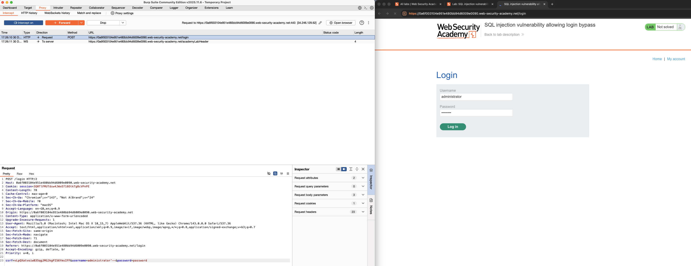
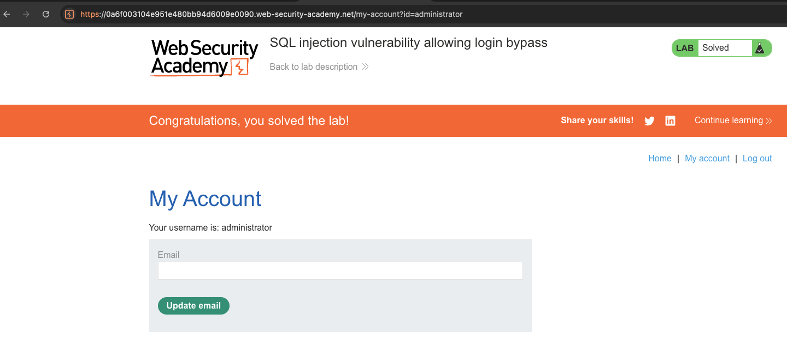

# SQL Injection
**Lab: SQL injection vulnerability allowing login bypass (Web Security Academy)**

**Level: Apprentice**

---

## Vulnerability Overview

SQL injection occurs when user-supplied input is embedded directly into an SQL query without escaping or parameterisation. An attacker can insert SQL syntax to alter the query's logic - in this case, bypassing authentication entirely.

The typical login query looks like this:

```sql
SELECT * FROM users WHERE username = 'input' AND password = 'input'
```

By injecting `administrator'--` as the username, the query becomes:

```sql
SELECT * FROM users WHERE username = 'administrator'--' AND password = '...'
```

The `--` sequence starts an SQL comment, which discards the password check. The query returns the administrator's row, and the application logs the attacker in - no valid password required.

---

## Steps to Solve the Lab

1. **Open the lab**
   - Navigate to the lab's login page.

2. **Start the proxy**
   - Launch Burp Suite.
   - Configure your browser to use Burp as an HTTP proxy, or use Burp's built-in browser.

3. **Enable interception**
   - In Burp, go to **Proxy > Intercept** and make sure interception is on, so that the login request is captured.

4. **Send a login request**
   - In the login form, enter `administrator` as the username and any value as the password.
   - Click **Log in** to send the request.

5. **Capture the request**
   - In Burp, view the intercepted `POST /login` request.
   - Locate the body parameters, which include `username` and `password`.

6. **Inject the SQL payload**
   - Change the `username` parameter value from:
     ```
     administrator
     ```
     to:
     ```
     administrator'--
     ```
   - Leave the `password` parameter set to any value.

   

7. **Forward the request**
   - Click **Forward** so the request reaches the server.
   - Turn interception off to let the browser load the response.

8. **Result**
   - The application logs you in as the administrator.
   - You are redirected to the **My account** page (`username: administrator`), and the lab is marked as **Solved**.

   

---

## Why This Works

The login query is constructed by concatenating user input directly into the SQL string:

```sql
SELECT * FROM users WHERE username = 'administrator'--' AND password = '...'
```

The `'` after `administrator` closes the string literal opened by the application. The `--` sequence starts an SQL comment, causing the database engine to ignore everything that follows, including the `AND password = '...'` clause. The query reduces to:

```sql
SELECT * FROM users WHERE username = 'administrator'
```

This returns the administrator's row without any password check. The application receives a valid user record, treats the result as a successful login, and starts a session as that user.

The underlying flaw is that authentication is decided by whether the query returns a row. Because the attacker controls the query's structure, they control that outcome.

---

## Remediation

- **Use parameterised queries (prepared statements)** - never concatenate user input into SQL strings. This is the primary fix:
  ```python
  cursor.execute(
      "SELECT * FROM users WHERE username = %s",
      (username,),
  )
  ```
- **Never compare passwords in SQL.** Look the user up by username only, then verify the supplied password against a stored hash in application code, using a constant-time comparison. Passwords should be stored using a slow, salted password-hashing function such as bcrypt, scrypt, or Argon2id - never plaintext, and never a fast general-purpose hash such as MD5 or SHA-256.
- **Use an ORM** (SQLAlchemy, Hibernate, Active Record), which parameterises by default. Raw-SQL escape hatches within an ORM must still be parameterised.
- **Apply least privilege** - the database account used for the login query should have read-only access to the tables it needs, and no administrative rights.
- **Return generic authentication errors** - a single "Invalid username or password" message avoids confirming which usernames exist.

> **On input validation:** rejecting quotes or filtering "dangerous" characters is *not* a substitute for parameterisation. Blocklists are routinely bypassed, and they break legitimate input such as the surname `O'Brien`. Validate input against an allow-list where the format is genuinely constrained, and treat it as defence in depth on top of parameterised queries - never as the primary control.

---

Link: https://portswigger.net/web-security/sql-injection/lab-login-bypass
