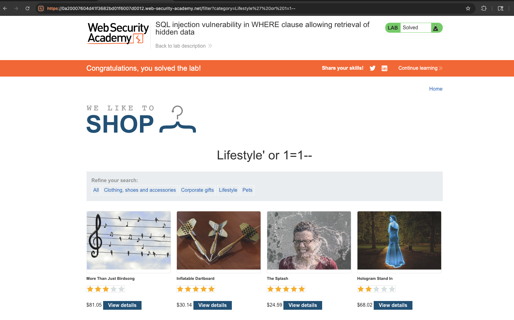

# SQL Injection
**Lab: SQL injection vulnerability in WHERE clause allowing retrieval of hidden data (Web Security Academy)**

**Level: Apprentice**

---

## Vulnerability Overview

This lab demonstrates a classic SQL injection in a `WHERE` clause. The application filters products by category using a URL parameter that is inserted directly into an SQL query without parameterisation:

```sql
SELECT * FROM products WHERE category = 'Lifestyle' AND released = 1
```

The `released = 1` condition hides unreleased products from regular users. By injecting into the `category` parameter, an attacker can rewrite the query's logic - removing that filter and returning every row in the table, including the hidden ones.

The root cause is **string concatenation of user input into an SQL query** instead of the use of parameterised queries.

---

## Steps to Solve the Lab

1. **Open the lab**
   - Navigate to the shop page that displays products filtered by category.

2. **Choose any category**
   - For example, click **Lifestyle**.
   - Notice that the URL contains the parameter:
     ```
     ?category=Lifestyle
     ```

3. **Identify the vulnerable parameter**
   - The `category` value is concatenated directly into the SQL query on the server side, with no parameterisation.

4. **Inject the SQL payload**
   - Modify the URL to:
     ```
     ?category=Lifestyle' OR 1=1--
     ```
   - Full URL example:
     ```
     https://<lab-id>.web-security-academy.net/filter?category=Lifestyle%27+OR+1%3D1--
     ```
   - The payload contains characters that are significant in a URL, so it must be URL-encoded: `'` becomes `%27`, `=` becomes `%3D`, and spaces become `+` (or `%20`). Entering the unencoded payload in the browser's address bar generally works too, as the browser encodes it automatically.

5. **Observe the result**
   - All products are returned on the page, including the unreleased ones.
   - The lab is automatically marked as **Solved**.

   

---

## Why This Works

The injected payload transforms the query from:

```sql
SELECT * FROM products WHERE category = 'Lifestyle' AND released = 1
```

into:

```sql
SELECT * FROM products WHERE category = 'Lifestyle' OR 1=1--' AND released = 1
```

- `'` closes the string literal opened by the application.
- `OR 1=1` adds a condition that is always true, so every row matches.
- `--` starts an SQL comment, so the rest of the original query - including the `AND released = 1` filter - is ignored by the database.

The `WHERE` clause reduces to `category = 'Lifestyle' OR 1=1`, which evaluates to true for every row. The query therefore returns the entire `products` table: all categories, and both released and unreleased products.

> **Note:** because `OR 1=1` is true for every row, the original `Lifestyle` filter is discarded as well. The result is not "all Lifestyle products" but every product in the table - which is exactly what makes the hidden, unreleased items visible.

---

## Remediation

- **Use parameterised queries (prepared statements)** - the single most effective fix. The query becomes:
  ```python
  cursor.execute(
      "SELECT * FROM products WHERE category = %s AND released = 1",
      (category,),
  )
  ```
  The user input is then treated as data and never as SQL syntax.
- **Use an ORM** (SQLAlchemy, Django ORM, Hibernate), which parameterises by default. Note that ORMs still expose raw-SQL escape hatches, and those must be parameterised too.
- **Validate input against an allow-list** - if categories come from a fixed set, reject any value that is not on that list.
- **Apply least privilege** - the database account used for this query should have read-only access, limited to the tables it needs.

---

Link: https://portswigger.net/web-security/sql-injection/lab-retrieve-hidden-data
