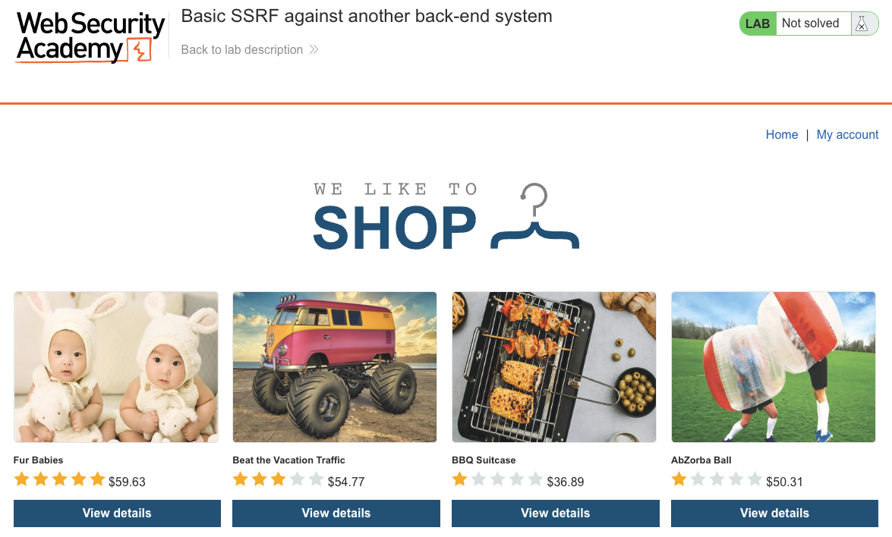
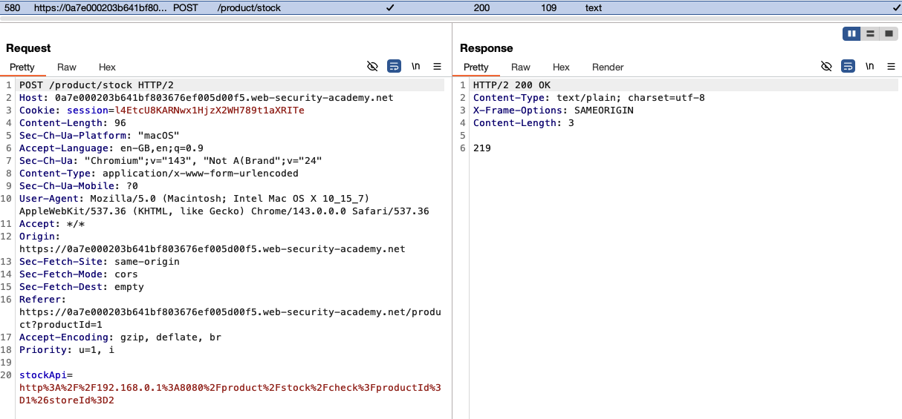
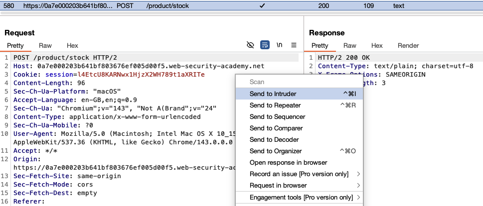
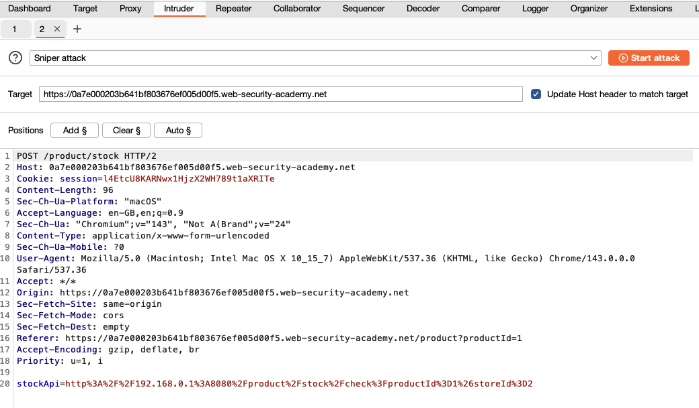
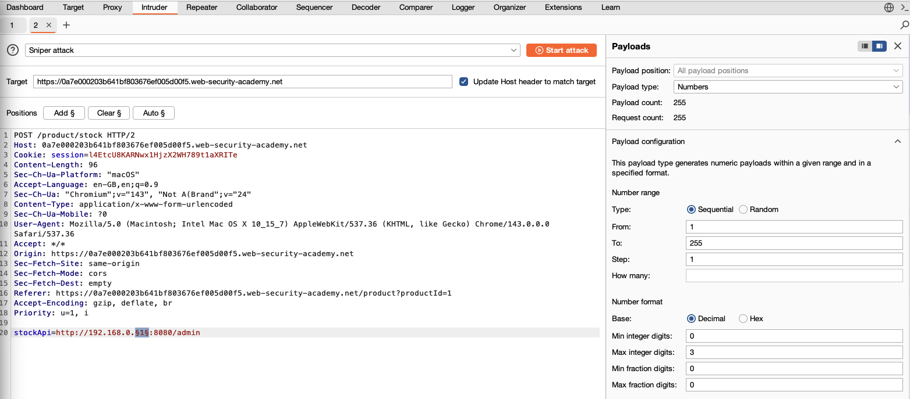
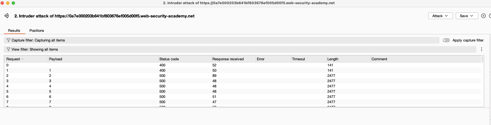
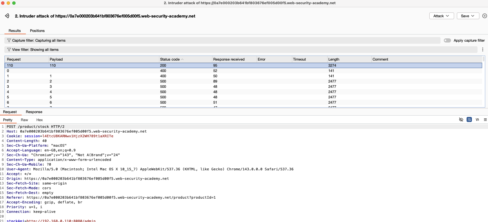
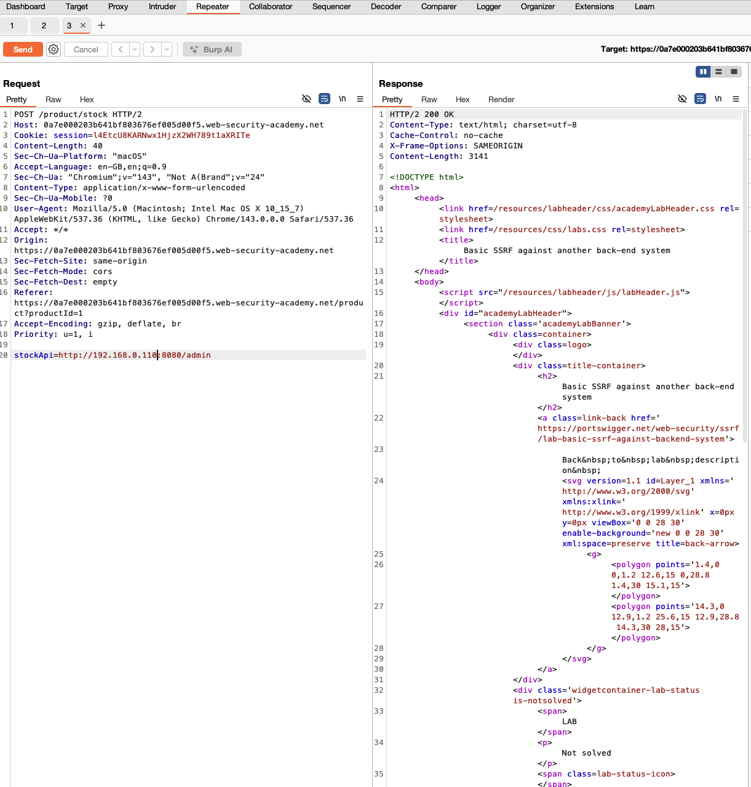
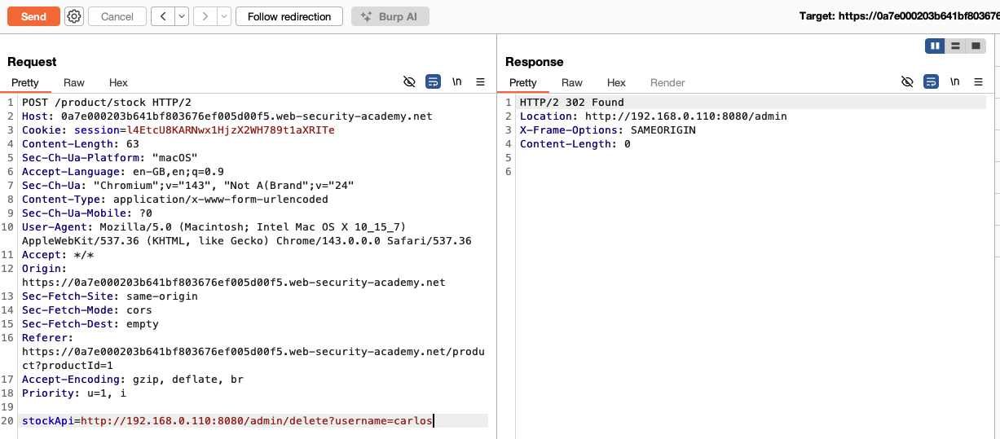
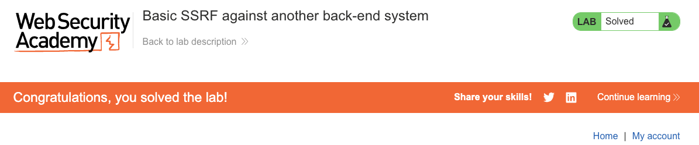

# Server-Side Request Forgery (SSRF)
**Lab: Basic SSRF against another back-end system (Web Security Academy)**

**Level: Apprentice**

---

## Vulnerability Overview

This lab demonstrates SSRF used for **internal network enumeration**. The vulnerable server can fetch arbitrary URLs, including internal IPs that are unreachable from the public internet. The attacker uses Burp Intruder to scan the internal `192.168.0.0/24` subnet via the `stockApi` parameter, discovers an internal admin panel on port 8080, and then calls its delete endpoint to perform a privileged action.

This shows that SSRF is not just about localhost. It can expose any internal system that the vulnerable server can reach, including infrastructure that was never designed to be internet-facing.

---

## Steps to Solve the Lab

1. **Browse the shop and open a product**
   - Open the lab and browse the product catalog.

   

2. **Identify the SSRF-vulnerable parameter**
   - Click **Check stock** on any product.
   - Intercept the `POST /product/stock` request in Burp and send it to **Repeater**.
   - The body contains a `stockApi` URL parameter pointing at an internal host, for example:
     ```
     stockApi=http://192.168.0.1:8080/product/stock/check?productId=1&storeId=2
     ```

   

3. **Send the request to Intruder**
   - Right-click the request and choose **Send to Intruder**.

   

4. **Set the payload position**
   - In Intruder, set the attack type to **Sniper**.
   - Clear the auto-added positions, then place a single payload marker on the final octet of the internal IP and target the `/admin` path:
     ```
     stockApi=http://192.168.0.§1§:8080/admin
     ```

   

5. **Configure the payload set**
   - Set the payload type to **Numbers**.
   - Configure a sequential range **From 1**, **To 255**, **Step 1**.
   - Start the attack.

   

6. **Enumerate the internal subnet**
   - Let the attack run through all 255 requests. Most responses return `400` or `500`.

   

7. **Find the internal admin host**
   - Sort the results by **Status code** or **Length**. One request stands out with `200 OK` and a larger response length (the admin panel HTML).
   - Note the octet that succeeded. In this run it is `110`, so the internal admin host is `192.168.0.110`.

   

8. **Confirm access to the internal admin panel**
   - Back in Repeater, send:
     ```
     stockApi=http://192.168.0.110:8080/admin
     ```
   - The server returns the internal admin panel HTML.

   

9. **Delete carlos via SSRF**
   - Change the `stockApi` value to:
     ```
     stockApi=http://192.168.0.110:8080/admin/delete?username=carlos
     ```
   - The server proxies the request to the internal system, which processes the delete and responds with `302 Found`.

   

10. **Result**
    - The lab banner changes to **"Congratulations, you solved the lab!"**.

    

---

## Why This Works

The internal admin service at `192.168.0.110:8080` was designed to be reachable only from within the private network, not from the public internet. It has no authentication because it was assumed to be unreachable externally.

The SSRF vulnerability in the public-facing application breaks this assumption. Any request the attacker can instruct the vulnerable server to make is effectively a request from inside the network perimeter.

> **Note:** The exact internal IP address is randomized per lab instance. Do not hardcode `192.168.0.110`; enumerate the subnet each time to find the host that responds with `200 OK`.

---

## Remediation

- **Allowlist permitted external domains.** The `stockApi` parameter should only accept requests to a known, validated list of stock API endpoints.
- **Block private IP ranges at the application level.** Before fetching any URL, resolve the hostname and reject destinations in:
  - `127.0.0.0/8` (loopback)
  - `10.0.0.0/8`, `172.16.0.0/12`, `192.168.0.0/16` (private networks)
  - `169.254.0.0/16` (link-local / cloud metadata)
- **Secure internal services independently.** Internal services should require authentication and not rely solely on network isolation.
- **Apply egress filtering.** Use firewall rules to restrict which internal IPs the application servers can reach.

---

Link: https://portswigger.net/web-security/ssrf/lab-basic-ssrf-against-backend-system
