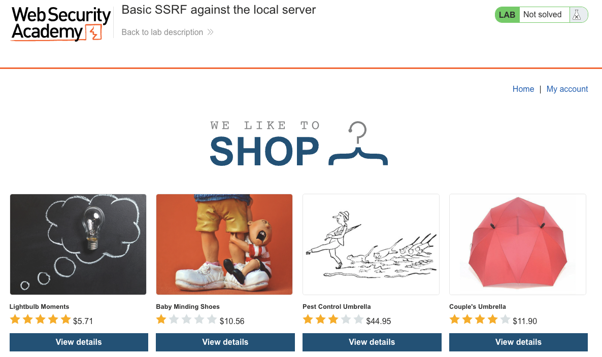
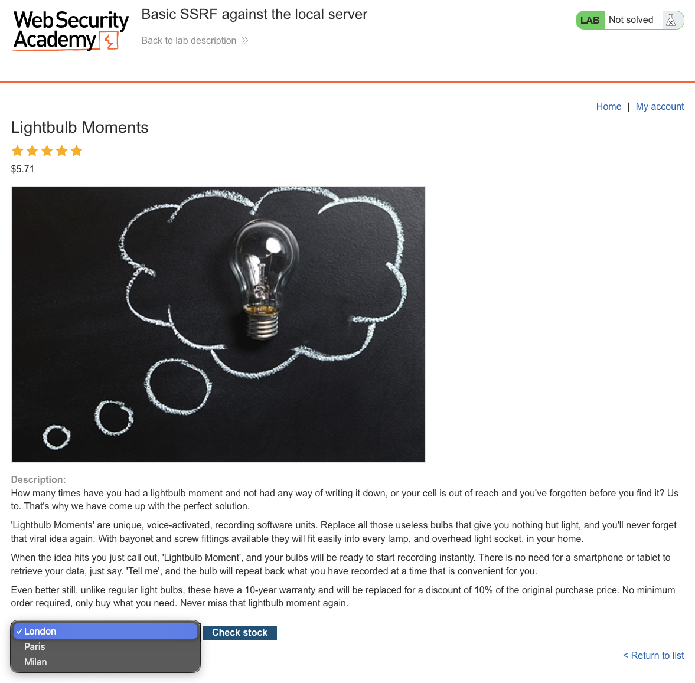
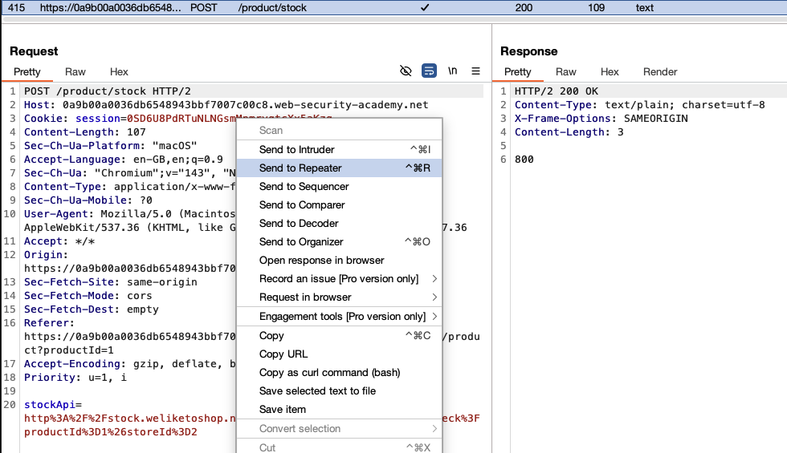
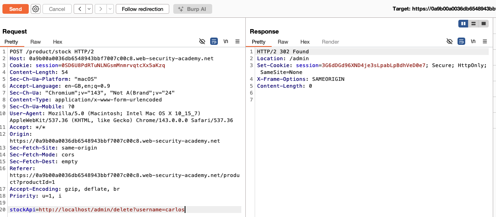
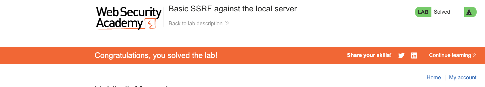

# Server-Side Request Forgery (SSRF)
**Lab: Basic SSRF against the local server (Web Security Academy)**

**Level: Apprentice**

---

## Vulnerability Overview

SSRF (Server-Side Request Forgery) occurs when an attacker can make the server perform HTTP requests to an arbitrary URL, including URLs on the server's own local network or on `localhost`. The server acts as a proxy, making requests that the attacker cannot make directly.

In this lab, a stock-checking feature accepts a `stockApi` URL parameter and fetches it server-side. By replacing the URL with `http://localhost/admin`, the attacker causes the server to query its own admin interface, which is restricted to local connections. From the server's perspective, the request comes from `127.0.0.1`, so access is granted.

---

## Steps to Solve the Lab

1. **Browse the shop and open a product**
   - Open the lab and browse the product catalog.

   

2. **Trigger the stock check**
   - Open any product and click **Check stock**. The shop looks up availability at a specific store location.

   

3. **Identify the SSRF-vulnerable parameter**
   - Intercept the `POST /product/stock` request in Burp and send it to **Repeater**.
   - The request body contains a URL-encoded `stockApi` parameter:
     ```
     stockApi=https%3A%2F%2Fstock.weliketoshop.net%2Fproduct%2Fstock%3FproductId%3D1%26storeId%3D1
     ```
   - This is a URL that the server fetches server-side.

   

4. **Probe localhost**
   - Change the `stockApi` value to `http://localhost/admin`:
     ```
     stockApi=http://localhost/admin
     ```
   - Send the request. The server returns the HTML of the admin panel, confirming that it will fetch internal URLs.

5. **Delete carlos via SSRF**
   - Change the `stockApi` value to the delete endpoint:
     ```
     stockApi=http://localhost/admin/delete?username=carlos
     ```
   - Send the request. The server executes the delete on your behalf and responds with `302 Found` redirecting to `/admin`.

   

6. **Result**
   - The lab banner changes to **"Congratulations, you solved the lab!"**.

   

---

## Why This Works

The server makes HTTP requests based entirely on the attacker-supplied `stockApi` value:

```python
# Vulnerable pseudocode:
def check_stock(request):
    api_url = request.form['stockApi']
    response = requests.get(api_url)   # fetches ANY URL, including localhost
    return response.text
```

The admin panel at `http://localhost/admin` is restricted to local requests. When the application server itself makes the request (due to SSRF), that request originates from `127.0.0.1`, so the access control check passes.

---

## Remediation

- **Validate and restrict the URLs the server is allowed to fetch.** Maintain a strict allowlist of permitted domains and schemes. Reject `localhost`, `127.0.0.0/8`, `169.254.0.0/16`, `10.0.0.0/8`, `172.16.0.0/12`, and `192.168.0.0/16`.
- **Use DNS resolution checks.** Resolve the destination hostname and verify that it does not point to a private or loopback address before making the request. Re-validate after resolution to defend against DNS rebinding.
- **Move outbound HTTP calls to a dedicated service.** A separate egress proxy with strict egress rules limits what the application can reach.
- **Never use network location for authorization.** The admin panel should require authenticated user credentials, not just `localhost` as the source IP.

---

Link: https://portswigger.net/web-security/ssrf/lab-basic-ssrf-against-localhost
