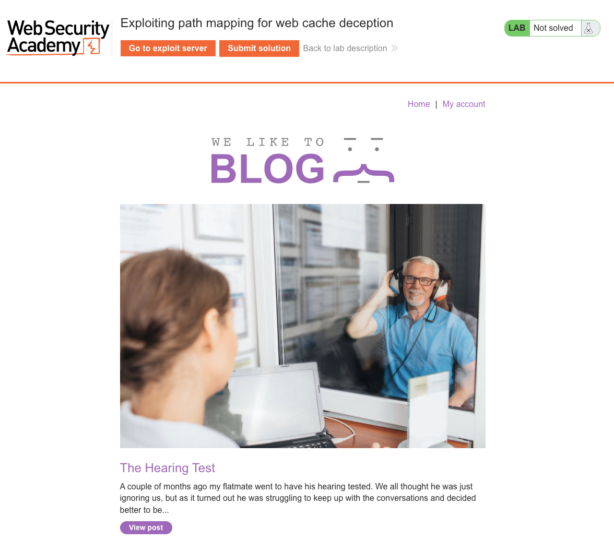
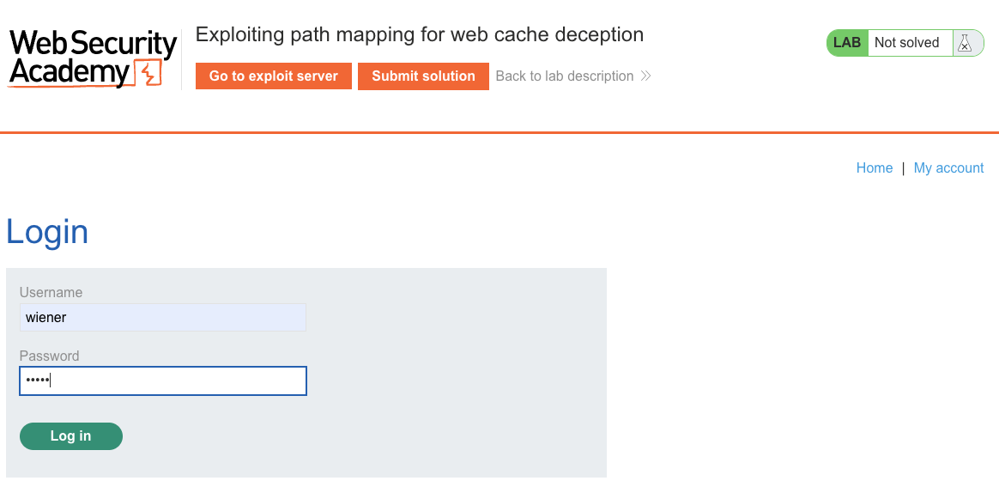
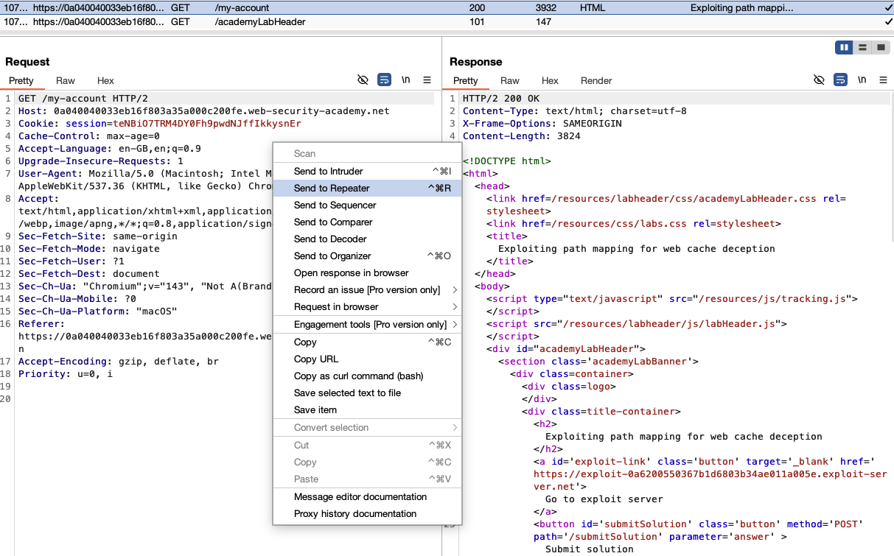
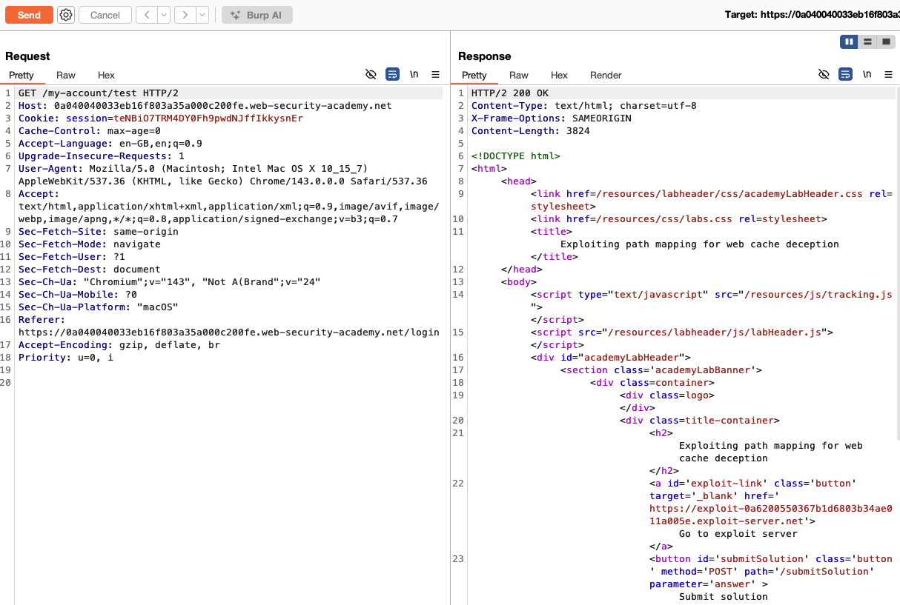
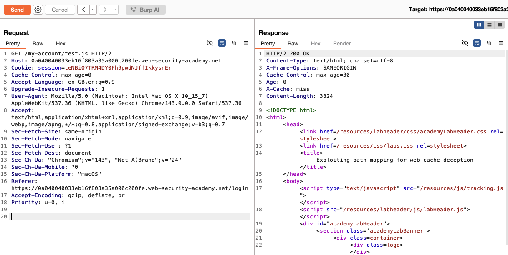
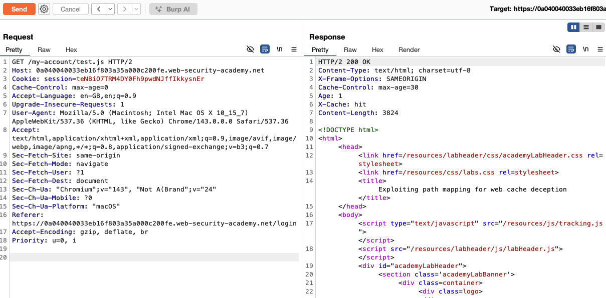
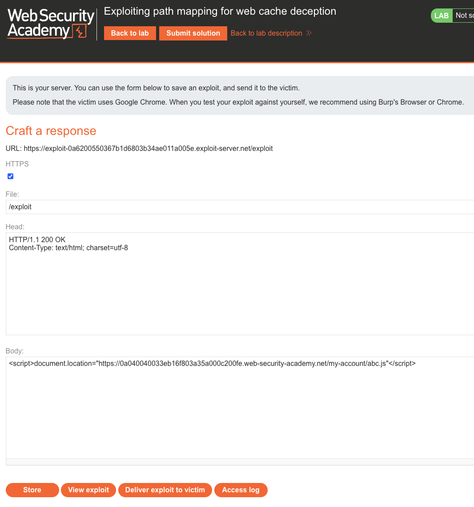
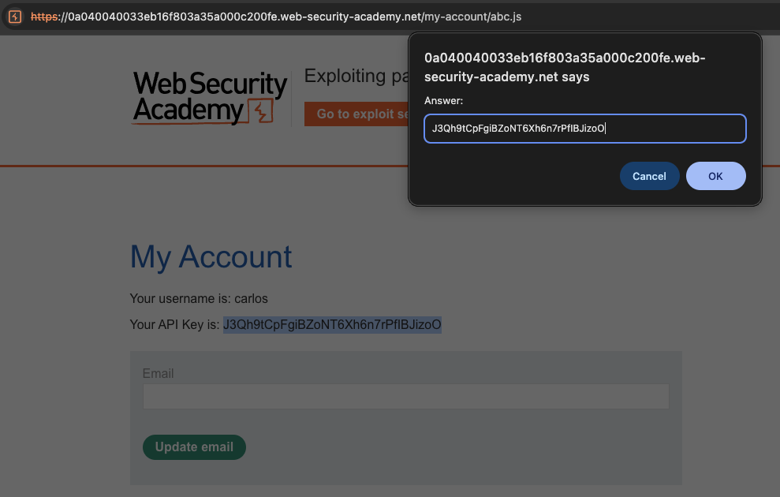
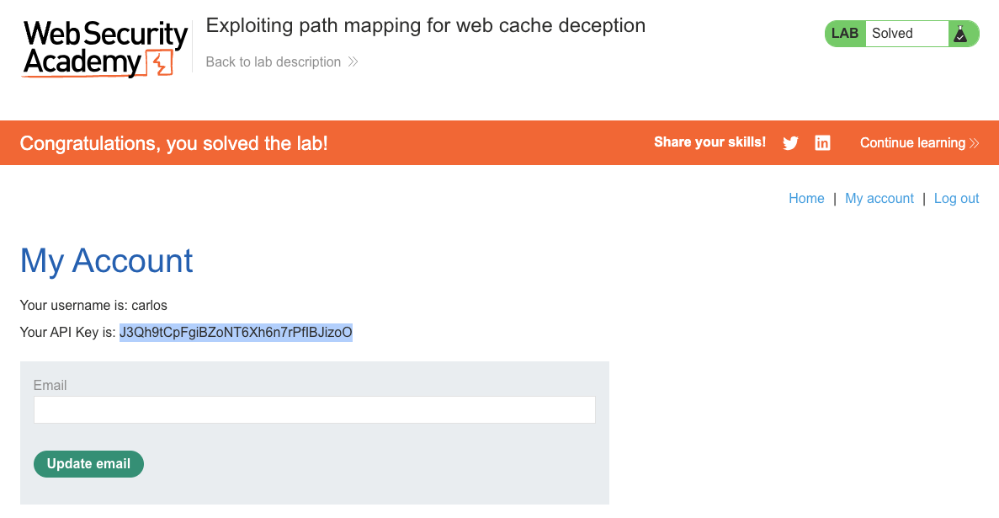

# Web Cache Deception

**Lab: Exploiting path mapping for web cache deception (Web Security Academy)**

**Level: Apprentice**

---

## Vulnerability Overview

Web cache deception is an attack in which the attacker tricks a caching layer (a CDN or reverse proxy) into caching a response that contains sensitive, user-specific data, and then retrieves that cached response as an unauthenticated user.

The attack exploits a **path mapping discrepancy** between the cache and the origin server. The cache uses the URL path to decide what to store, treating anything that looks like a static file as cacheable. The origin server ignores the extra path segment and returns the authenticated user's account page. The cache stores this response under the static-looking URL, and the attacker then requests the same URL to receive the cached, sensitive page.

---

## Steps to Solve the Lab

### 1. Log in and observe the account page

Log in as `wiener` and visit `/my-account`. The page displays your API key, which is the sensitive data we ultimately want to steal from carlos's session.





### 2. Inspect the request in Burp

With Burp's proxy history open, locate the `GET /my-account` request and send it to Repeater for further testing.



### 3. Confirm the path mapping discrepancy

Append an arbitrary path segment to the request, for example `GET /my-account/test`. The origin server ignores the extra segment and still returns the authenticated account page (HTTP `200`). This confirms that the origin maps `/my-account/<anything>` to the account page.



### 4. Make the response cacheable

Change the path so that it ends in a static-looking extension, for example `GET /my-account/test.js`. The cache now treats the response as a static resource:

- The response includes `Cache-Control: max-age=30` and `X-Cache: miss` on the first request.



Send the identical request again. The response is now served from the cache:

- The response includes `X-Cache: hit` and a non-zero `Age`, confirming that the sensitive account page has been stored in the shared cache.



### 5. Deliver the exploit to the victim

On the exploit server, host a page that redirects the victim to the deceptive URL. Use the following body:

```html
<script>document.location="https://<lab-id>.web-security-academy.net/my-account/abc.js"</script>
```

Store the exploit and deliver it to the victim (carlos). Carlos's authenticated browser requests the URL, the origin returns his account page, and the cache stores it under `/my-account/abc.js`.



### 6. Retrieve the cached response

As an unauthenticated user (or in a fresh browser window), visit:

```
https://<lab-id>.web-security-academy.net/my-account/abc.js
```

The cache serves the stored response, which is carlos's account page, including his API key.



### 7. Submit carlos's API key

Paste the API key into the **Submit solution** form. The lab banner changes to **"Congratulations, you solved the lab!"**.



---

## Why This Works

The cache and the origin server disagree about what the URL represents:

- **Cache:** sees `/my-account/abc.js`, assumes it is a static `.js` file, and caches it for all users.
- **Origin:** sees `/my-account/abc.js`, ignores the unknown path segment, and serves the authenticated user's account page.

The authenticated victim's response is stored in the shared cache. The attacker later retrieves it without authentication, because the cache key is just the URL, which the attacker already knows.

---

## Remediation

- **Cache based on explicit allowlists, not file extensions.** Cache only URLs that are explicitly marked as public and static. Do not infer cacheability from `.js`, `.css`, or `.png` extensions alone.
- **Set `Cache-Control: no-store` on all authenticated responses.** This instructs caches not to store the response. Adding `private` further prevents storage in shared caches.
- **Configure the cache to exclude paths that serve user-specific data.** Paths such as `/my-account/*`, `/dashboard/*`, and `/api/*` should never be cached by a shared CDN.
- **Validate path components on the origin.** If `/my-account/abc.js` is not a valid route, return `404` rather than silently falling back to the account page.

---

**Reference:** https://portswigger.net/web-security/web-cache-deception/lab-wcd-exploiting-path-mapping
