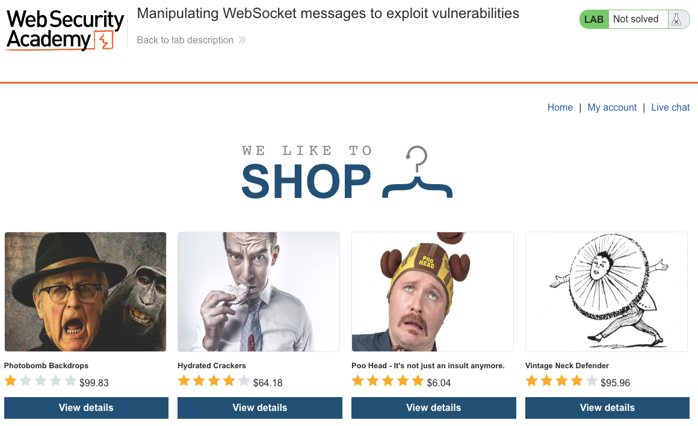
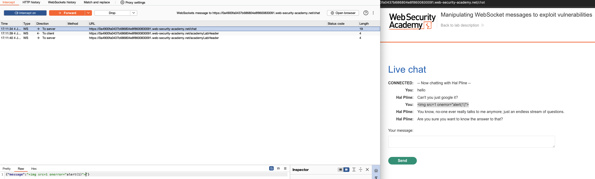
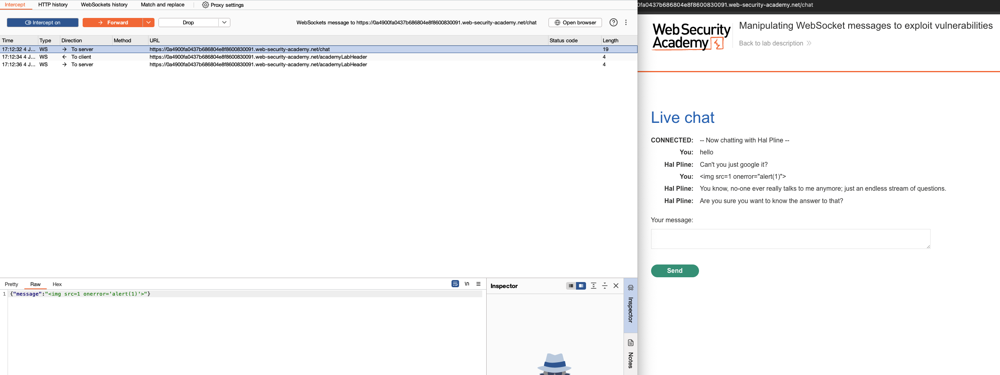
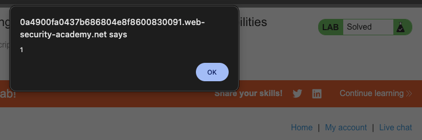
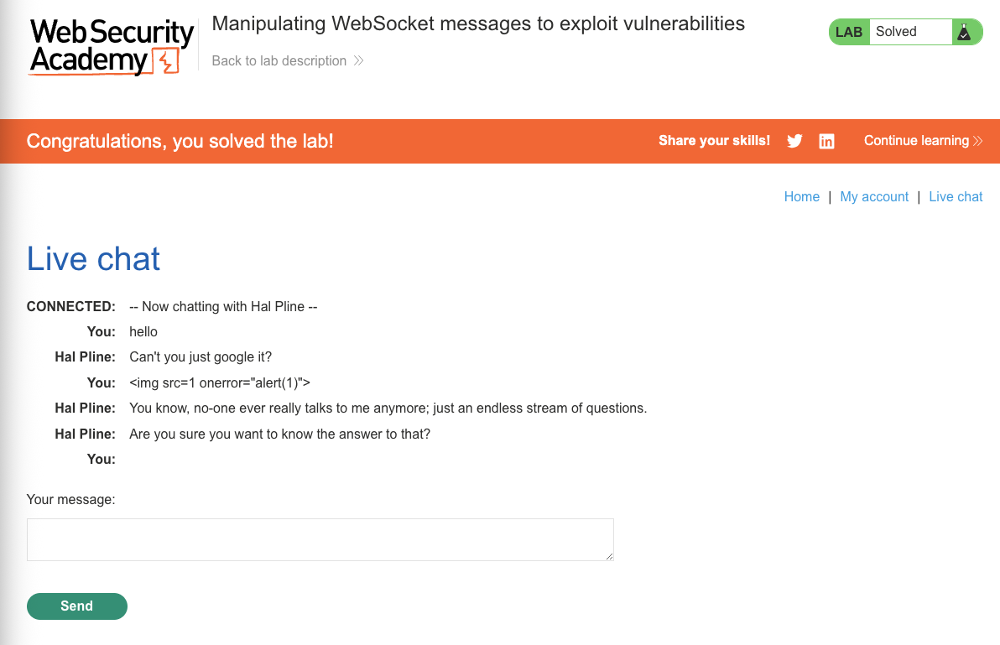

# WebSockets

**Lab: Manipulating WebSocket messages to exploit vulnerabilities (Web Security Academy)**

**Level: Apprentice**

---

## Vulnerability Overview

WebSocket connections maintain a persistent, bidirectional channel between the client and the server. Messages sent over this channel are processed by the server just like HTTP parameters, but they often receive less security scrutiny because they happen after the initial HTTP handshake and are less visible to developers.

In this lab, the live chat application reflects WebSocket message content directly into the HTML without encoding. An attacker who intercepts and modifies an outgoing WebSocket message can inject an XSS payload that executes in every participant's browser. This is **stored XSS via WebSocket** - the payload is sent through a channel that developers may not have considered part of the attack surface.

---

## Steps to Solve the Lab

1. **Open the live chat**
   - Navigate to the **Live chat** page and send a test message (e.g. "hello").
   - In Burp, go to the **WebSockets history** tab - the message appears as a WebSocket frame.

   

2. **Enable WebSocket interception**
   - In Burp, go to **Proxy > WebSockets**, and enable message interception.

3. **Send a message and intercept it**
   - Type another message in the chat and click **Send**.
   - Burp intercepts the WebSocket frame before it reaches the server.
   - The JSON payload looks like: `{"message":"hello"}`

4. **Inject an XSS payload**
   - Modify the `message` value to:

     ```json
     {"message":""}
     ```

     The escaped quotes keep the frame valid JSON. Burp's Raw editor forwards the frame as literal bytes without validating JSON syntax, so an unescaped version would still reach the server - but the server's message handler expects valid JSON, so escaping is what makes the payload reliably parse and reach the vulnerable sink.
   - Forward the modified message.

   

   

5. **Observe code execution**
   - The chat interface renders the injected `` element.
   - The browser tries to load `src=1`, fails, and fires the `onerror` handler, which executes `alert(1)`.

   

6. **Result**
   - The lab banner changes to **"Congratulations, you solved the lab!"**.

   

---

## Why This Works

The server receives the WebSocket message and broadcasts the `message` field into the chat HTML without HTML-encoding it:

```javascript
// Vulnerable server-side handler (pseudocode)
websocket.on('message', (data) => {
    const msg = JSON.parse(data);
    broadcast(`<p>${msg.message}</p>`);  // no encoding
});
```

The injected `` element is inserted directly into the DOM as HTML, not as text. Every connected client's browser parses and executes it.

---

## Remediation

- **HTML-encode all content before inserting it into the DOM** - whether data arrives via HTTP or WebSocket, it must be treated as untrusted and encoded before rendering.
- **Use safe DOM APIs** - insert chat messages using `textContent`, not `innerHTML`:

  ```javascript
  const p = document.createElement('p');
  p.textContent = msg.message;   // renders as text, never as HTML
  chatBox.appendChild(p);
  ```

- **Validate and sanitize on the server** - apply the same input validation to WebSocket messages as to HTTP parameters. Strip or reject HTML tags if they serve no purpose in a chat context.
- **Content Security Policy (CSP)** - a strict CSP (e.g. disallowing inline event handlers and `unsafe-inline` scripts) reduces the impact of injected markup even if encoding is missed. It is a defense-in-depth measure, not a substitute for proper encoding.

---

Link: https://portswigger.net/web-security/websockets/lab-manipulating-messages-to-exploit-vulnerabilities
